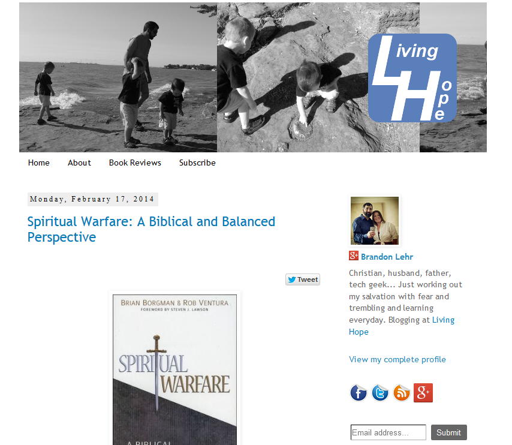

**Update 9/5/2016** This blog is now created with <a href="https://jekyllrb.com/" >Jekyll</a> and hosted on <a href="https://pages.github.com/">GitHub-Pages</a>

Well, I&#8217;ve finally done it. I started a WordPress Blog.

That&#8217;s not to say that I&#8217;m new to the blogging world. I started my first Blogger blog back in 2008.

## Living Hope

Most of my posts were of Christian book reviews and the occasional opinion piece. I spent a lot of time learning how blogging, and the whole internet, in general, worked. This was the initial spark that set me on fire for technology.

**I WAS ON THE INTERNET!!!**

I couldn&#8217;t believe how freaking awesome it was to be able to publish to the web.

It was here, that I was first exposed to HTML and CSS. I had my first experiences with copying and pasting code &#8211; anxiously waiting to see if this would be the time something worked! I can remember creating cheat sheets on how to create links and insert images. Everything seemed like magic.

I was happy to write my reviews and experiment with new things for a few years, but then I wanted to learn more about the web. So, I started learning more in depth about HTML and CSS, utilizing resources such as [codecademy](http://www.codecademy.com/). I couldn&#8217;t get enough of it. I would spend any free moment working through challenges, moving on to the next thing.

That next thing was JavaScript. I quickly completed the lessons on codecademy and then moved on to [Code School](https://www.codeschool.com/).

From there I headed over to [Tree House](https://teamtreehouse.com/) and studied their WordPress Development courses. Along the way, I have also picked up a little PHP. As you can see, I have spent the past year or so meandering through web technologies, soaking in all that I can.

## So I said all that to say this

I started this here WordPress blog to document this next stage in my adventure. In fact, the theme that I&#8217;m using is a one of [my own creation](https://github.com/blehr/Pummel). I plan on posting about some of my other work and all that I may find interesting along the way.

If you would care to join me, feel free to subscribe and keep up with all of my latest ramblings.
