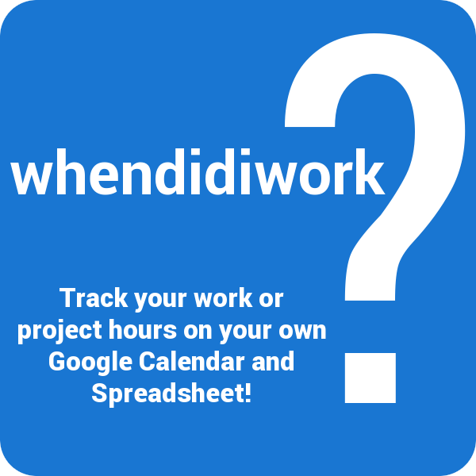
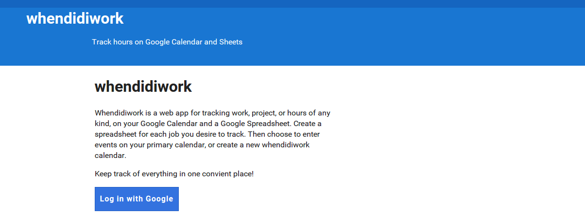
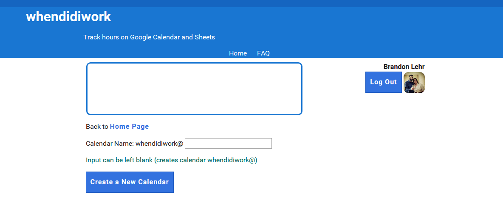
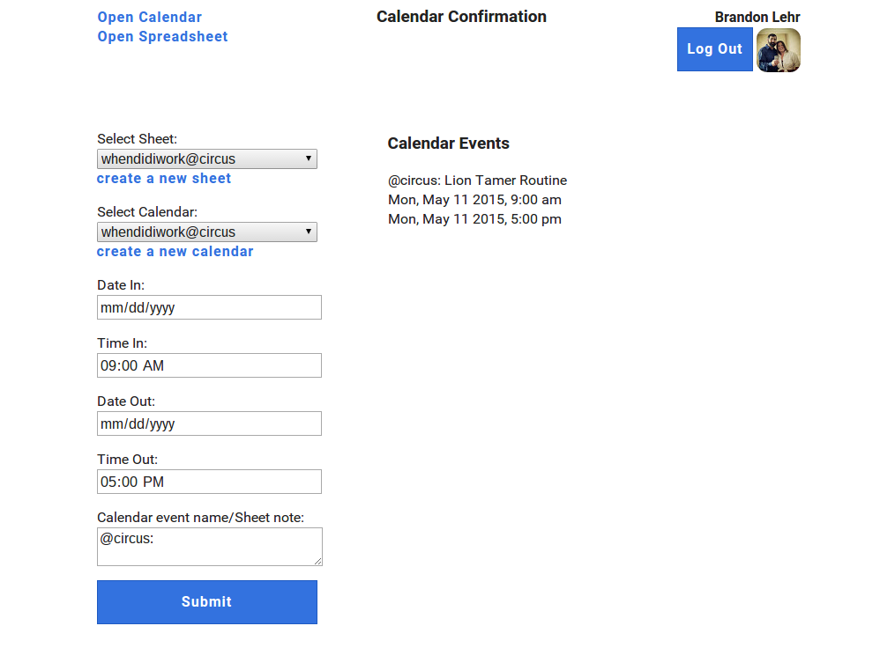

  <strong>Update 12/5/2015 </strong>I have released an updated version of the app with new features! When you&#8217;re finished here, head over and <a href="/i-built-this/javascript/angular/2015/12/06/new-and-improved-whendidiwork-com">learn more</a> about the new whendidiwork!

## A simple time clock application. That&#8217;s all I was looking for.

Now granted I had a few stipulations.

<ul class="post-list">
  <li>
    <strong>Portable Data</strong>. Preferably stored on my Google calendar and a Google sheet. The last thing I wanted was for everything to be locked in an app database, leaving me empty handed if I switched or wiped my phone.
  </li>
  <li>
    <strong>Convenience</strong>. Data must be able to be entered from anywhere with neither too many or too few options. If the process is in any way difficult, I&#8217;m more than likely to &#8220;forget&#8221; to keep up my entries.
  </li>
  <li>
    <strong> Night-Shift Friendly</strong>. This was the biggest deal breaker. I&#8217;ve been on the graveyard shift for more than a few years now. Most time keeping apps, expect work hours to be performed over the course of a single day. That&#8217;s not the case in my situation. I start my shift in the evening and end the next morning. This causes problems when displaying a set of these hours labeled simply as &#8220;a Monday&#8221; or &#8220;a Tuesday&#8221;.
  </li>
</ul>

My first and most obvious thought was, &#8220;There must be an Android app for this.&#8221; I checked out a few of the many to be found in the Google Play Store, but nothing seemed to satisfy my needs. Each was always lacking in one or more of the areas I wanted. So, I decided to build my own!<!--more-->

## whendidiwork.com

[whendidiwork](http://whendidiwork.com) is a web app that can be accessed from any browser, desktop or mobile. Simply sign in with your Google account and all data will be written to any calendar and spreadsheet that you own. Enter your data once and save to both places.

With whendidiwork you can create a new calendar or use an existing one. I prefer to use one &#8220;whendidiwork&#8221; calendar for tracking all of my hours across different projects and jobs. Then I create a spreadsheet for each individual job to which I record my times.

To solve the night-shift dilemma, there are separate inputs for dates and times, both in and out. There is even room to write a note to be recorded with each entry.

## What about privacy?

To use the app, a user must first log in with their Google account and then accept the app permissions. If after trying whendidiwork, you decide that it&#8217;s not for you, there is a link on the FAQ page that will take you to where you can revoke all of the apps permissions. Easiest breakup ever!

## Why wait?

I built [whendidiwork](http://whendidiwork.com) to be the time clock app I wanted and I hope that you like it as well! Please give it a try and let me know what you think in the comments below.

[whendidiwork.com](http://whendidiwork.com)

&nbsp;
