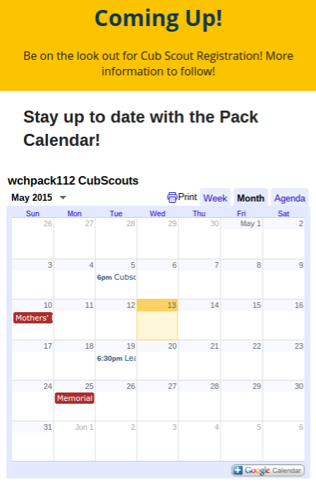
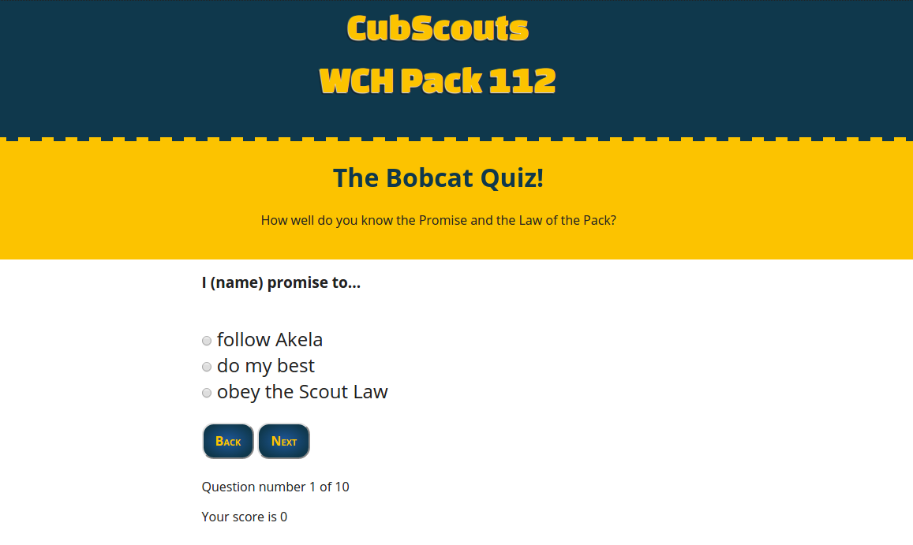
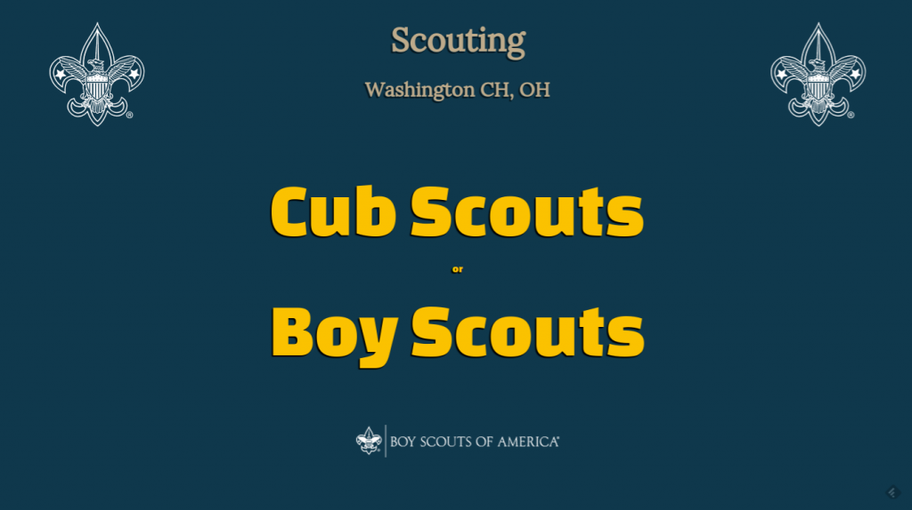
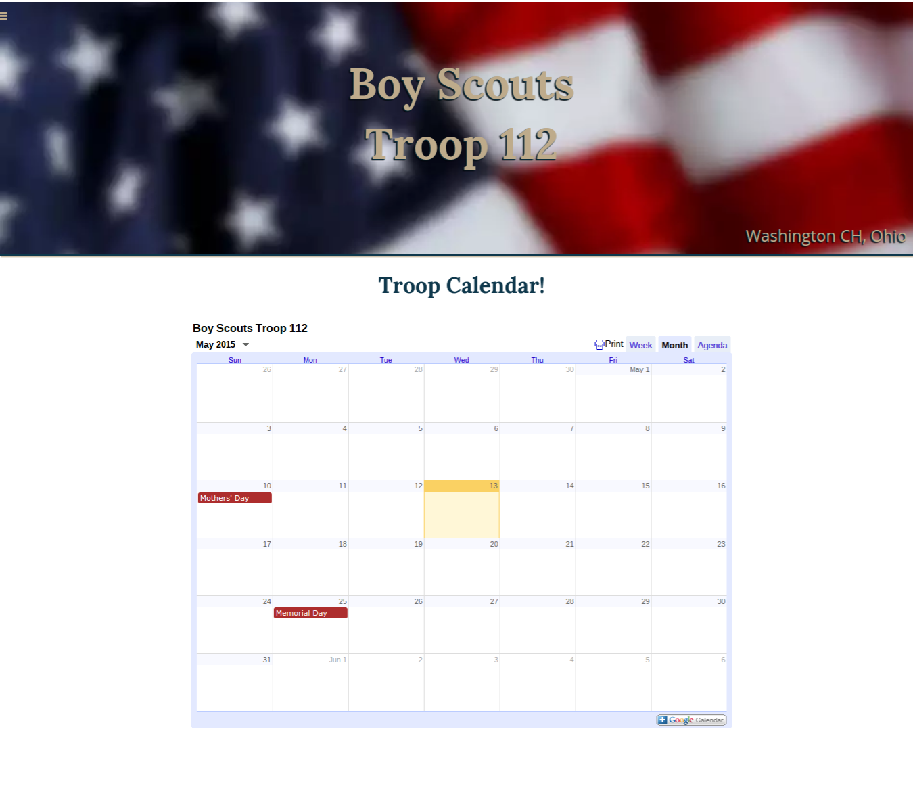

## Does something truly exist if it doesn&#8217;t have a website?

This day and age you have to wonder, &#8220;Does something truly exist if it doesn&#8217;t have a website?&#8221; I&#8217;ve been involved with scouting for the past 6 years. A scouting program without a website! Everything that I have read on learning web design and programming has stressed the fact that one should attempt to apply new skills to a real-world project as soon as possible. A pack website was my chance to flex some new muscles.

## We need a calendar

My first decision was that we absolutely needed a calendar. I wanted to create a pack calendar that could be easily maintained and shared. The obvious choice was a Google calendar. Editing ability could be shared among leaders, and parents could subscribe to stay up to date right from their phone.<!--more-->

## Responsive Design

The site had to have a responsive design. I was sure that most visits would be from parents checking the schedule from their smartphones. This led to my biggest challenge. How to embed a Google calendar and have it scale to all screen sizes?

I found the solution in this Smashing Magazine article, [Making Embedded Content Work In Responsive Design](http://www.smashingmagazine.com/2014/02/27/making-embedded-content-work-in-responsive-design/), that worked perfectly. This is one resource worth bookmarking!

## A JavaScript Powered Quiz

Back when I was studying JavaScript, I had made a dynamic quiz as a learning project. This seemed like the perfect time to use it! The Cub and Boy Scouts have different things that they have to learn, such as the Law of the Pack and the Scout Oath. Now they are able to test their skills right on the site.

## Two sites are better than one

The pack website went so well, I decided to build one for the Boy Scouts as well! To save money I wanted to purchase one domain to use between the two, so I built a portal page allowing visitors to enter the site they want.

## wchscouts.com

Everything is up and running. Click over and check it out, but be sure to come back and let me know what you think, or what could be improved. If you&#8217;re interested in scouting, you can learn more at the [BSA website](http://www.scouting.org/).

[wchscouts.com](http://wchscouts.com/)

&nbsp;
