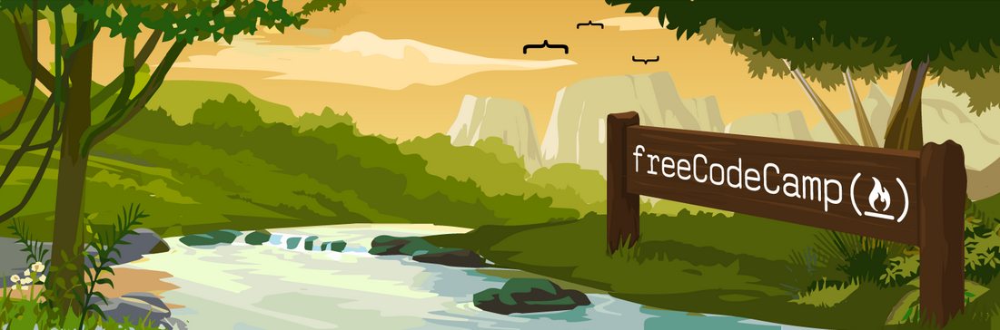

I recently enrolled in [Free Code Camp](http://www.freecodecamp.com/), a JavaScript Full Stack Developer training program. I&#8217;m always looking for a chance to improve my skills, so when I heard of the offer (and the price!), I was in.

Don&#8217;t let the fact that the course is free, fool you into thinking that this isn&#8217;t a quality program. So far I&#8217;ve enjoyed it immensely. As you can see, this course is meant to lead you into a career as a full stack JavaScript developer.

## How Does it Work?

Each section consists of lessons, called waypoints. These may be lessons that have been created by, and for, Free Code Camp or they may lead you to other established resources on the web. When I first joined the HTML, CSS, and Bootstrap waypoints were utilizing [codecademy](http://www.codecademy.com/) courses. Since then, these have been updated to in-house created waypoints. They look nicely done but having completed the old waypoints, I haven&#8217;t felt the need to go back and retake these.

Next, are bonfires. Bonfires are challenges focusing on JavaScript algorithm scripting. I have completed the first set of bonfires, and I must say, a few of them are more than a little challenging! Take your time on these. This is where the real learning takes place. Forcing your mind to think through the problems and researching whichever string or array function you are are trying to utilize will expand the range of your JavaScript knowledge.

The course also features zip lines and base jumps which are project oriented challenges. Currently I am starting on number nine, Intermediate Algorithm Scripting, in the image above, so I haven&#8217;t experienced these as of yet, but I am looking forward to it.

## Wanting to learn or improve your JavaScript?

I recommend checking out Free Code Camp. There are many resources on the web for learning JavaScript, but many of them leave you feeling &#8220;Well, what do I do next?&#8221; Free Code Camp leads you step by step towards your goal and provides opportunities to put that newly acquired knowledge to use in real-world exercises.

Have you tried or are thinking of enrolling in Free Code Camp? I would love to hear your thoughts and experiences. If you have any other recommendations for learning JavaScript, feel free to list them as well.

[Free Code Camp](http://www.freecodecamp.com/)

&nbsp;
