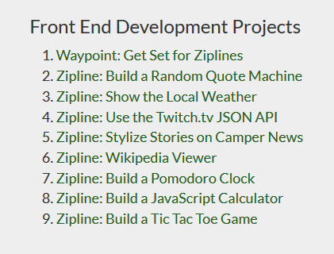
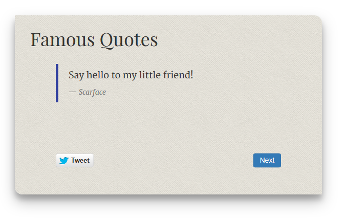
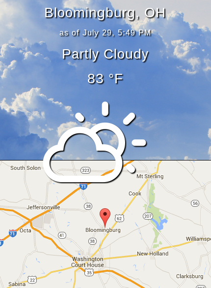
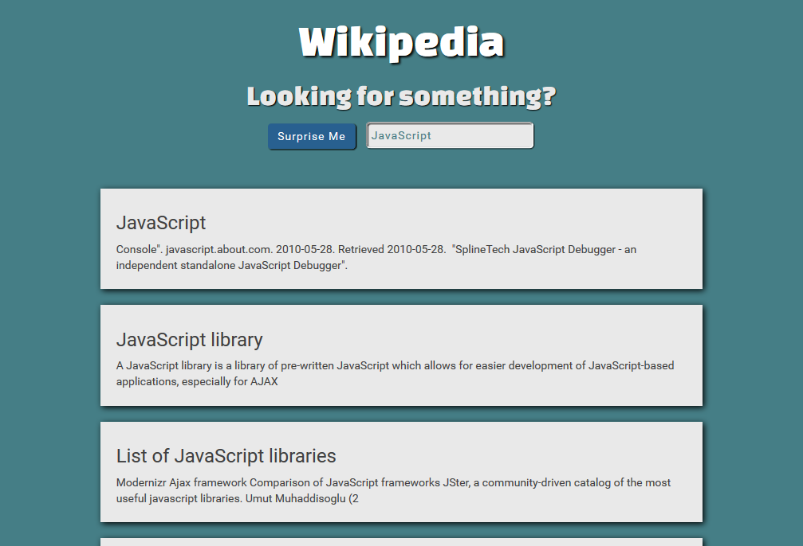
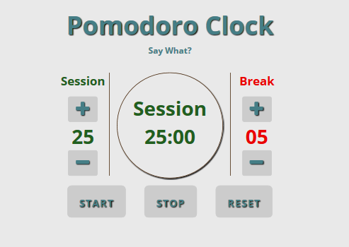

It&#8217;s been just over a month since [I last wrote](/javascript/learn-to-code/free-code-camp/2015/06/19/free-code-camp-full-stack-javascript-training) of my adventures in Free Code Camp. Since then I have been trudging along, making use of every free moment I can get, to learn and build. All the hard work is paying off, and as of now, I have completed six of the eight ziplines!

## What are Ziplines?

On the course [map](http://www.freecodecamp.com/map) they are listed as Front End Development Projects. These are small projects built with [CodePen](http://codepen.io), that put your knowledge to the test. The algorithm challenges are great, but the surest way to cement your skills is to build something. From start to finish you will encounter everything from the challenge of getting the layout correct in CSS to Ajax API requests.<!--more-->

### First up, is the Quote Machine Zipline.

The most interesting thing about this project was trying to get the tweet button to open up with the quote text already populated. This is quite easy to do if the content is static, but took some figuring out with each quote being dynamically loaded. [<i class="fas fa-chevron-right"></i> Quote Machine](http://codepen.io/blehr/full/BNxepx)

Next up, is showing the local weather.

For this project, I wanted to try and do something a little different. The instructions called for background images that reflected the current weather. I liked this idea, but since I was using the geolocation API to find the user&#8217;s location, I wanted to include a map. The top of the screen displays the weather information over top of a corresponding background image, while the lower portion is a Google Map with the user&#8217;s location pinned. What can I say, I think maps are cool! [<i class="fas fa-chevron-right"></i> Local Weather](http://codepen.io/blehr/full/PqaWbV)

### Using the Twitch.tv JSON API

This project consisted a a list of usernames that were to be displayed indicating whether or not they were currently streaming. [<i class="fas fa-chevron-right"></i> Twitch.tv API](http://codepen.io/blehr/full/WvzXyR)

### Stylize Stories on Camper News

Here the goal was to utilize the [Free Code Camp Camper News](http://www.freecodecamp.com/news) API to create a redesigned news page. [<i class="fas fa-chevron-right"></i> Camper News](http://codepen.io/blehr/full/oXMybN)

### Wikipedia Viewer

This was a fun project, building a site through which to search Wikipedia. It was my first time creating an autocomplete box and along the way I discovered many new and interesting articles. [<i class="fas fa-chevron-right"></i> Wikipedia Viewer](http://codepen.io/blehr/full/oXMVxZ)

### Pomodoro Clock

Seriously, the first thing I did was look up what this pomodoro thing was! You can read about it yourself here [Pomodoro Technique](https://en.wikipedia.org/wiki/Pomodoro_Technique). So, for this I needed an adjustable countdown timer for the work sessions and an adjustable timer for the breaks. All in all, it works pretty well, but personally I&#8217;m not sure I want to be racing the clock all that much! [<i class="fas fa-chevron-right"></i> Pomodoro Clock](http://codepen.io/blehr/full/VLVbZE)

### My CodePen Collection

You can view all my Free Code Camp Ziplines in my creatively named [CodePen collection, FreeCodeCamp](http://codepen.io/collection/nkNxkb/)!

I have are two more ziplines to go and then I start learning Angular, so stay tuned for my next Free Code Camp update!

&nbsp;
