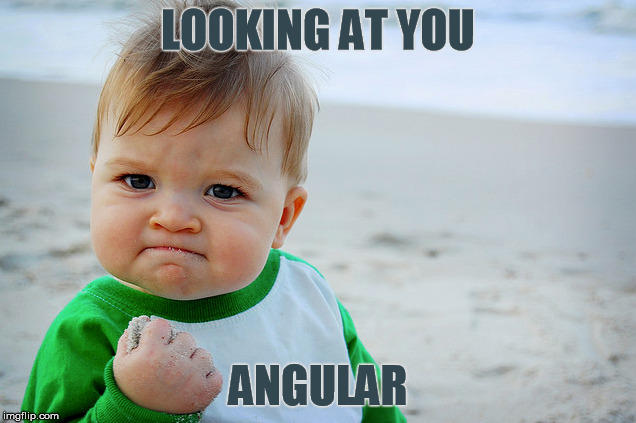

I was feeling pretty good. The [ziplines](/javascript/learn-to-code/free-code-camp/2015/07/29/free-code-camp-progress-update) were finished and my confidence with HTML, CSS, JavaScript, jQuery, and bootstrap was high. Bring it on! I&#8217;m ready for anything!

## AngularJS

Then along came Angular! [Free Code Camp](http://freecodecamp.com/) utilizes a CodeSchool course sponsored by Google, <a href="https://www.codeschool.com/courses/shaping-up-with-angular-js" target="_blank">Shaping Up With Angular.js</a> to introduce the front-end framework. The course is well made, as all of the CodeSchool courses are, and by the end you will have been introduced to many of the features and uses of the Angular framework.

The problem is that this course is the only Angular training on the Free Code Camp map. I wasn&#8217;t feeling all that confident that I could now just go out and build a Single Page App in all its glory! I really wanted to get a handle on this before moving on to node and the back-end.<!--more-->

## Don&#8217;t Give Up!

My first thought was to try and recreate all of the ziplines using Angular. This quickly informed me that I needed some more training.

 At first, it felt like I was taking a step backwards. I was hitting a wall trying to reproduce functionality with Angular that I had previously done without it. So I put my Google skills to use and went looking for the help I needed.

## AngularJS Tutorials and Help

The first place to obviously look is the [official documentation](https://angularjs.org/). Here you can find links to videos, resources, and the official Angular [PhoneCat tutorial](https://docs.angularjs.org/tutorial). The tutorial can be cloned from github.com and the code can be viewed at all of the individual steps along the way. I spent some time working through this, picking up a little more here and there.

Then I headed over to [thinkster.io](https://thinkster.io) and worked through some of their [A Better Way to Learn AngularJS](https://thinkster.io/a-better-way-to-learn-angularjs/) guide. The course is free, unless you wish to view the accompanying videos. Once you finish this course, you can branch off into some of their more advanced topics and demos.

Next, I headed over to [egghead.io](https://egghead.io/). They have many Angular tutorials to choose from, though some are only available with a paid subscription. Once I created an account, I received an email providing a link to a series on how to build an AngularJS App from Scratch. Working my way through building the Eggly app really helped to cement a lot of what I had been exposed to in all of the tutorials I had been following. **Repetition is the key!**

## What&#8217;s Next

I&#8217;m still taking a break from the Free Code Camp map until I get a stronger grasp of Angular. Things are coming together, but there is still so much more to learn. Everything works suspiciously well in all of the simple todo list type demos. I&#8217;m bracing myself for what&#8217;s next!

So, how is your Angular knowledge coming along? What resources are you finding most helpful?
