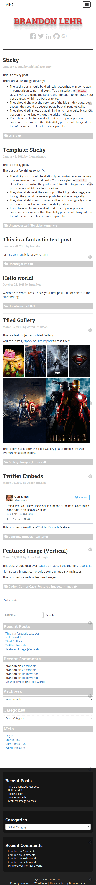

Why stop with just one WordPress theme?

With [Pummel](/i-built-this/wordpress/2015/12/02/introducing-pummel-wordpress-theme), I went all out with the customizer options. I decided to to make a new theme, where less is more. I call it [Mine](https://github.com/blehr/mine), because it&#8217;s Mine ( I&#8217;m so clever ).

I haven&#8217;t submitted it to the WordPress theme directory yet. I wanted to test it out and see what everyone else thought about it first. Overall, I kept things basic. A simple white and grey theme with red accents, perfect for letting the content shine forth. The header includes a widget on the right-hand side, which is styled for jetpack&#8217;s social media links widget and the footer accommodates three widget areas as well.

&nbsp;

## Mobile Ready

Mine is built with [bootstrap](http://getbootstrap.com) so it is responsive and fully functional on all mobile devices. A theme that works everywhere. Awesome!

So let me know what you think in the comments. I&#8217;m open to any and all suggestions!
