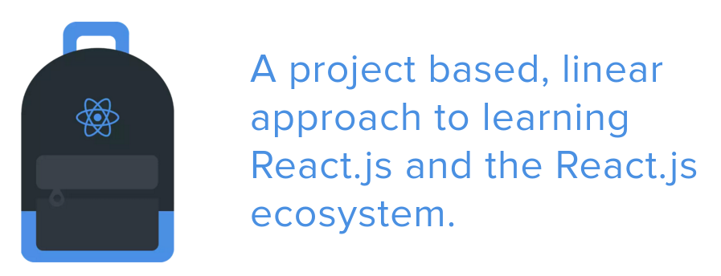

There is always more to learn! JavaScript is moving fast and doesn&#8217;t appear to be slowing anytime soon. The question is, &#8220;How do I go about learning all of these new things?&#8221; Where do I go to learn Angular, React, Node, Backbone, RxJs, Browserify, Gulp, Webpack, ES6, 7, 2025&#8230; ? Where can I learn it and learn it correctly?

If you&#8217;re expecting the answer to end all answers, I&#8217;m sorry. I&#8217;m still searching for many of these myself, but I have found one answer.<!--more-->

## The React.js Program

I stumbled upon the [React.js Program](http://courses.reactjsprogram.com/courses/reactjsfundamentals) while surfing the web for yet another react tutorial, one that would explain the tech and how it all fits together.

### This is the One!

I can&#8217;t recommend it enough. I have recently completed the React.js Fundamentals course and feel as though I have a much better grasp on writing apps with react. The tutorial is very well done.

The course starts out teaching how to setup webpack to compile and run a dev server. If you have played with React at all you have faced the realization that setting up the tooling can be half the battle!

The course walks through building a small application utilizing react, react router, and axiom. Every step of the way is explained clearly and thoroughly. I not only learned what works, but why it works.

The [React Fundamentals](http://courses.reactjsprogram.com/courses/reactjsfundamentals) is a free course written using ES5 syntax. If you&#8217;re looking for ES6/7 or Redux, there are lessons for that as well. You can view all of [Tyler McGinnis&#8217;](https://twitter.com/tylermcginnis33) offerings [here](http://www.reactjsprogram.com/). Only the Fundamentals course is free, I haven&#8217;t tried the others yet, but should be shortly.
