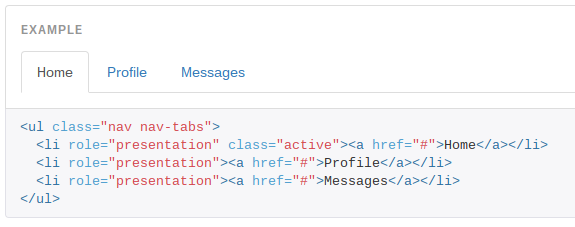

I love using bootstrap in my projects. Whether it is the grid system, the styling, or the components, it just makes it quick and easy to get something up and running.

I&#8217;ve been playing around with react.js a lot lately and have encountered some unique difficulties. One, in particular, involved implementing the [Bootstrap Tabs](http://getbootstrap.com/components/#nav-tabs) component with react-router. Bootstrap places an &#8216;active&#8217; class on the active link, which gives it the &#8216;tab&#8217; outline. The problem is that bootstrap places this class on the `<li>` that contains the link and not on the link itself.

React-router supplies a Link component that knows when it is active and allows that link to be styled appropriately using either inline styles or a className. This seems like a quick solution, but notice the active style is applied to the link and we need it on the `<li>`.

`li>Link to="/about" activeStyle={{ color: 'red' }}>About/Link>/li>`

`li>Link to="/about" activeClassName="active">About/Link>/li>`

## How do I fix this?

So, here&#8217;s what I found that worked. Create a Tab component that renders an individual link. Pull in the router context to check if the route is active and choose the className that is to be placed on the `<li>`. Build the tab as a Link or IndexLink depending on whether or not onlyActiveOnIndex was passed to it. Then it is just a matter of using the Tab components inside of a NavTab component which renders the `<ul>` and the Tabs. The code below should clear things up.

`gist:a14f187d7ecf88b2e803e92d81069b93`

This solved my problem, but if you encounter any trouble, just give me a shout and I&#8217;ll see what I can do.
