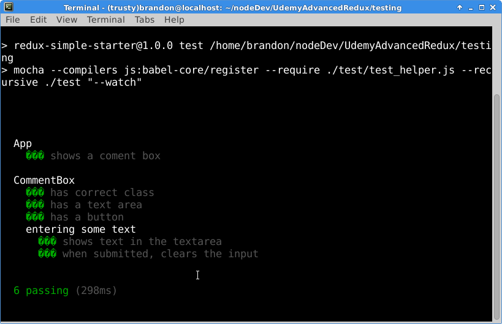
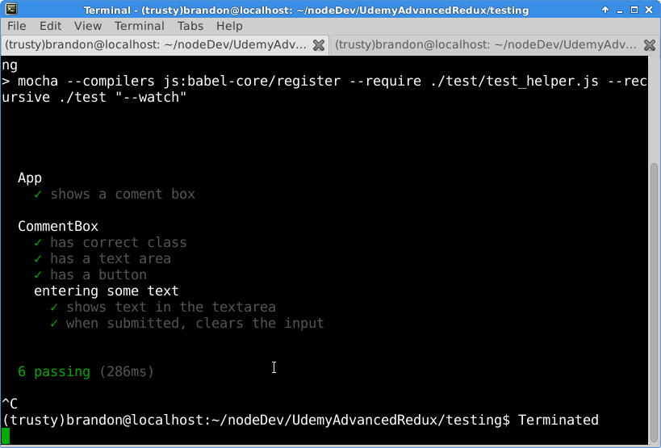

I&#8217;m running an xfce4 desktop on a trusty ubuntu](https://github.com/dnschneid/crouton) on an antique [Acer Chromebook](http://www.pcworld.com/article/2046477/review-acers-c710-2457-chromebook-is-a-basic-bargain-browsing-machine.html). I know, it&#8217;s about the craziest development setup ever, but I make it work. Anyway, I had a problem with the terminal displaying the odd question marks, ���, instead of the special characters that it should have. This wasn&#8217;t the end of the world, just rather annoying. So, I decided to find a fix. It turns out it was rather simple in my case. From the terminal go to edit => preferences => advanced, and at default character encoding select Unicode => UTF-8. Close out the terminal and reopen, profit!

I&#8217;m not sure if this will fix everyone&#8217;s problem, Linux can be a scary world, but it can&#8217;t hurt to try!

&nbsp;
