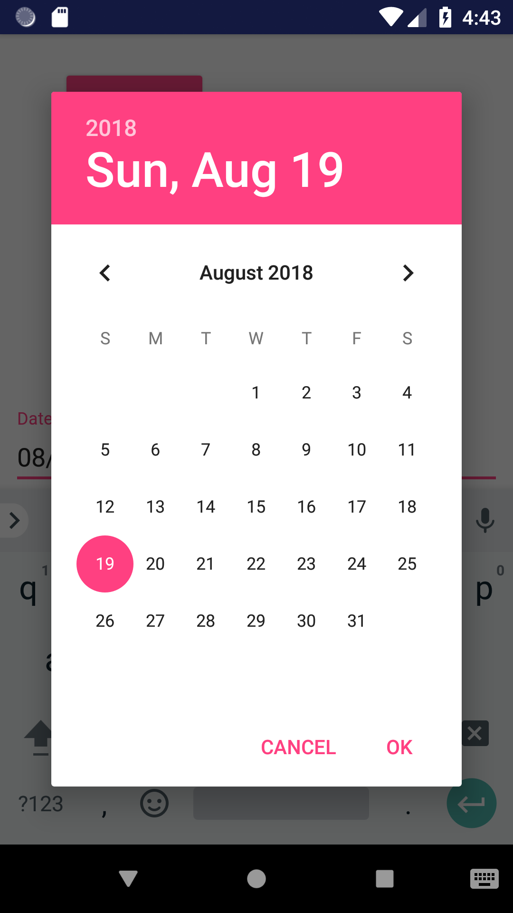

I recently ran into a situation in which I had to launch a date-picker fragment from a fragment. I had used the date-picker before, calling it from an activity and implementing an interface. Calling from a fragment can be handled the same way, but the response goes to the controlling activity. In this instance I wanted the result to go directly to the calling fragment. So this is what I came up with.

### The Fragment calling the DatePicker

The most important part is the line `newFragment.setTargetFragment(MyFragment.this, REQUEST_CODE);`. The target lets the new fragment know where to report back to and the REQUEST_CODE is just an integer used for identification.

The date selected in the date-picker is received in the onActivityResult method.

`gist:59866174a314e03e8a1697fc83880d1d`

### DatePickerFragment

Here is the code for the date-picker fragment. It is in the OnDateSet method that the date is sent back to the target fragment.

`gist:b27c043858044749f07e4f1b52a3161f`

All of the code for this example can be found on github at [DatePickerExample](https://github.com/blehr/DatePickerExample) 
If you have any questions or have any suggestions on how to improve the code, I would love to hear them.