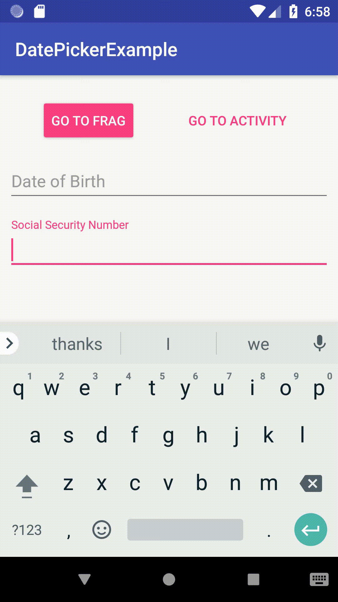

<!--  -->


<div class="mw-400">
  
</div>

One thing I find really convenient when filling out forms is when the text is formatted in the correct pattern without me having to think about it. When an input just smashes all the numbers together it is harder for the user to recognize whether or not they have entered the correct data. It also leads to user confusion as they wonder whether or not they are supposed to enter the normal spaces, dashes, or parentheses, one would include when writing the requested information down.

So, how do we fix this in an Android application?

The easiest way is to create a class that implements [TextWatcher](https://developer.android.com/reference/android/text/TextWatcher) and add it as a Text Change Listener to the required Edit Text. 

Here is the Social Security Mask.

```java
// SsnMask.java

package com.blehr.datepickerexample;

import android.text.Editable;
import android.text.TextWatcher;

import java.util.Locale;

public class SsnMask implements TextWatcher {

    private static final int MAX_LENGTH = 9;
    private static final int MIN_LENGTH = 3;

    private String updatedText;
    private boolean editing;

    @Override
    public void beforeTextChanged(CharSequence s, int start, int count, int after) {

    }

    @Override
    public void onTextChanged(CharSequence text, int start, int before, int count) {
        if (text.toString().equals(updatedText) || editing) return;

        String digits = text.toString().replaceAll("\\D", "");
        int length = digits.length();

        if (length <= MIN_LENGTH) {
            updatedText = digits;
            return;
        }

        if (length > MAX_LENGTH) {
            digits = digits.substring(0, MAX_LENGTH);
        }

        if (length <= 5) {
            String firstPart = digits.substring(0, 3);
            String secondPart = digits.substring(3);

            updatedText = String.format(Locale.US, "%s-%s", firstPart, secondPart);
        }
        else {
            String firstPart = digits.substring(0, 3);
            String secondPart = digits.substring(3, 5);
            String thirdPart = digits.substring(5);

            updatedText = String.format(Locale.US, "%s-%s-%s", firstPart, secondPart, thirdPart);
        }
    }

    @Override
    public void afterTextChanged(Editable editable) {
        if (editing) return;

        editing = true;

        editable.clear();
        editable.insert(0, updatedText);

        editing = false;
    }
}
```


As you can see, the TextWatcher requires 3 methods of which only 2 of are of concern. The afterTextChanged method handles updating the Edit Text text. The onTextChanged method contains the logic that dictates the formatting. This is where you can make the necessary changes to enable the desired formatting. 

Here is how to apply the mask.

```java
// MyFragment.java

package com.blehr.datepickerexample;

import android.app.Activity;
import android.content.Context;
import android.content.Intent;
import android.net.Uri;
import android.os.Bundle;
import android.support.v4.app.Fragment;
import android.support.v4.app.FragmentManager;
import android.support.v7.app.AppCompatActivity;
import android.support.v7.app.AppCompatDialogFragment;
import android.view.LayoutInflater;
import android.view.View;
import android.view.ViewGroup;
import android.widget.EditText;


public class MyFragment extends Fragment {

    EditText dateOfBirthET;
    String selectedDate;

    EditText ssnET;
    public static final int REQUEST_CODE = 11; // Used to identify the result

    private OnFragmentInteractionListener mListener;

    public MyFragment() {
        // Required empty public constructor
    }

    public static MyFragment newInstance() {
        MyFragment fragment = new MyFragment();
        return fragment;
    }

    @Override
    public void onCreate(Bundle savedInstanceState) {
        super.onCreate(savedInstanceState);
    }

    @Override
    public View onCreateView(LayoutInflater inflater, ViewGroup container,
                             Bundle savedInstanceState) {
        View view = inflater.inflate(R.layout.fragment_my, container, false);

        // get reference to edit text
        dateOfBirthET = view.findViewById(R.id.dateOfBirthET);

        // apply the input mask
        dateOfBirthET.addTextChangedListener(new DateMask());

        // get reference to edit text
        ssnET = view.findViewById(R.id.ssnET);

        // apply the input mask
        ssnET.addTextChangedListener(new SsnMask());


        // get fragment manager so we can launch from fragment
        final FragmentManager fm = ((AppCompatActivity)getActivity()).getSupportFragmentManager();

        // Using an onclick listener on the editText to show the datePicker
        dateOfBirthET.setOnClickListener(new View.OnClickListener() {
            @Override
            public void onClick(View v) {
                // create the datePickerFragment
                AppCompatDialogFragment newFragment = new DatePickerFragment();
                // set the targetFragment to receive the results, specifying the request code
                newFragment.setTargetFragment(MyFragment.this, REQUEST_CODE);
                // show the datePicker
                newFragment.show(fm, "datePicker");
            }
        });

        return view;
    }

    @Override
    public void onActivityResult(int requestCode, int resultCode, Intent data) {
        // check for the results
        if (requestCode == REQUEST_CODE && resultCode == Activity.RESULT_OK) {
            // get date from string
            selectedDate = data.getStringExtra("selectedDate");
            // set the value of the editText
            dateOfBirthET.setText(selectedDate);
        }
    }

    @Override
    public void onAttach(Context context) {
        super.onAttach(context);
        if (context instanceof OnFragmentInteractionListener) {
            mListener = (OnFragmentInteractionListener) context;
        } else {
            throw new RuntimeException(context.toString()
                    + " must implement OnFragmentInteractionListener");
        }
    }

    @Override
    public void onDetach() {
        super.onDetach();
        mListener = null;
    }

    public interface OnFragmentInteractionListener {
        // TODO: Update argument type and name
        void onFragmentInteraction(Uri uri);
    }
}
```


Just one line and the mask will be applied. 

Another common mask that I find myself needing, is a date mask. I normally need my dates formatted as MM/dd/yyyy. Here is the code for that.

```java
// DateMask.java

package com.blehr.datepickerexample;

import android.text.Editable;
import android.text.TextWatcher;

import java.util.Locale;

public class DateMask implements TextWatcher {

    private static final int MAX_LENGTH = 8;
    private static final int MIN_LENGTH = 2;

    private String updatedText;
    private boolean editing;


    @Override
    public void beforeTextChanged(CharSequence charSequence, int start, int before, int count) {

    }

    @Override
    public void onTextChanged(CharSequence text, int start, int before, int count) {
        if (text.toString().equals(updatedText) || editing) return;

        String digits = text.toString().replaceAll("\\D", "");
        int length = digits.length();

        if (length <= MIN_LENGTH) {
            updatedText = digits;
            return;
        }

        if (length > MAX_LENGTH) {
            digits = digits.substring(0, MAX_LENGTH);
        }

        if (length <= 4) {
            String month = digits.substring(0, 2);
            String day = digits.substring(2);

            updatedText = String.format(Locale.US, "%s/%s", month, day);
        }
        else {
            String month = digits.substring(0, 2);
            String day = digits.substring(2, 4);
            String year = digits.substring(4);

            updatedText = String.format(Locale.US, "%s/%s/%s", month, day, year);
        }
    }

    @Override
    public void afterTextChanged(Editable editable) {

        if (editing) return;

        editing = true;

        editable.clear();
        editable.insert(0, updatedText);

        editing = false;
    }

}
```


Well, I hope you find this helpful! I know I searched for these answers when I needed them. If you have any questions or ideas for improvements, my employer would love for me to hear them! :) 

All of the code can be found here on [github](https://github.com/blehr/DatePickerExample)