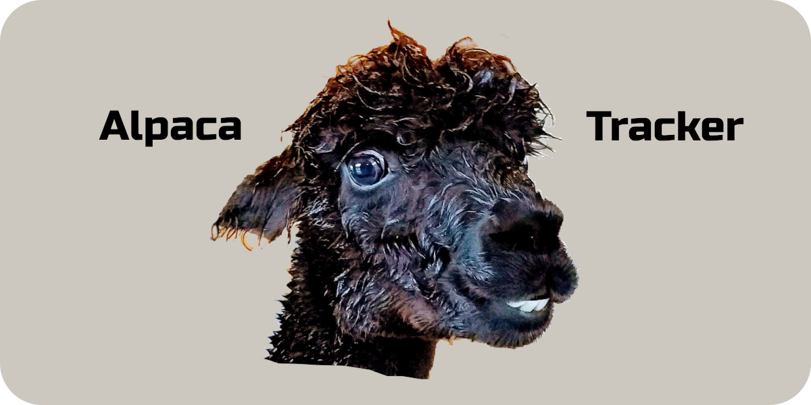
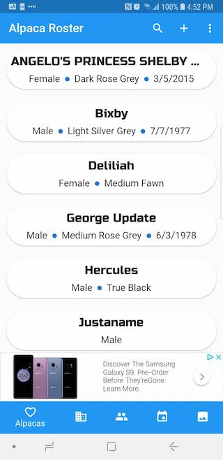

  

  
  

  

    
  

### Who doesn't love alpacas?

My kids have been showing alpacas through 4H at our county fair for a few years now. When we started, it was through the generosity of alpaca owners letting us work with and show their animals. Instantly, we fell in love.

Now, we own seven!

It was through the generosity of others that I got started with alpacas and now I want to give something back.

So I would like to announce the [Alpaca Tracker](https://alpacatracker.com). Alpaca Tracker is a free alpaca record keeping web app that allows you to conveniently, securely, and freely keep a record of all of your alpacas and their information!

There are other options out there, but they all come at a price, and often contain a confusing interface full of unneeded options, and slow response times. I designed Alpaca Tracker to be simple and effective, giving easy access to all of the information that you actually need on desktop and mobile to keep your herd successfully and efficiently managed.

### Alpaca Tracker on Android and iOS

Now you view and update alpaca information and events from your phone.

  

  
  

  

    
  

  

  
  

  

  
  

Here is a walk through video of the Alpaca Tracker.

  <iframe width="560" height="315" src="https://www.youtube.com/embed/pCbxZzvPvzc" frameborder="0" allow="autoplay; encrypted-media" allowfullscreen></iframe>

