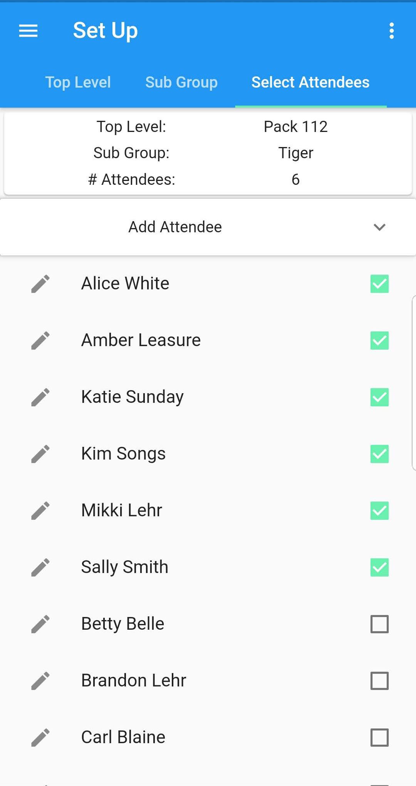
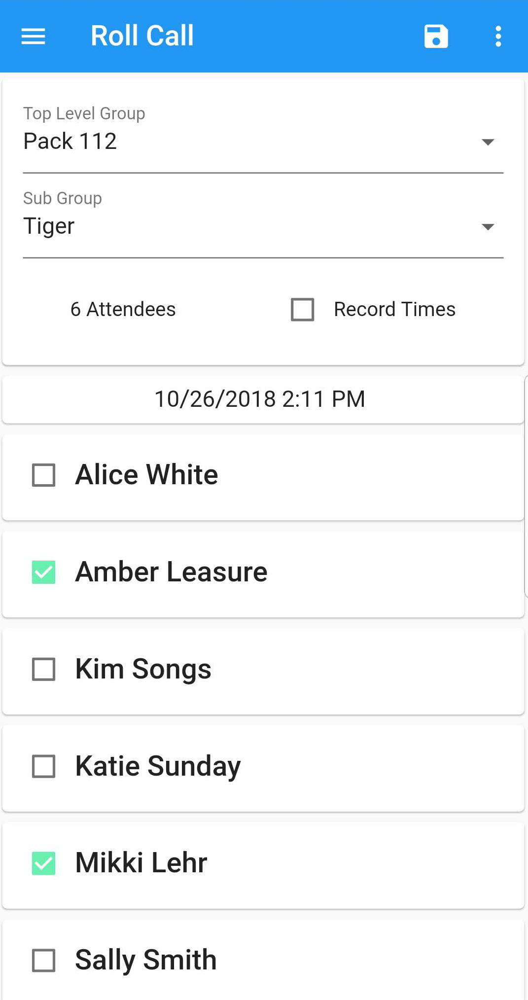
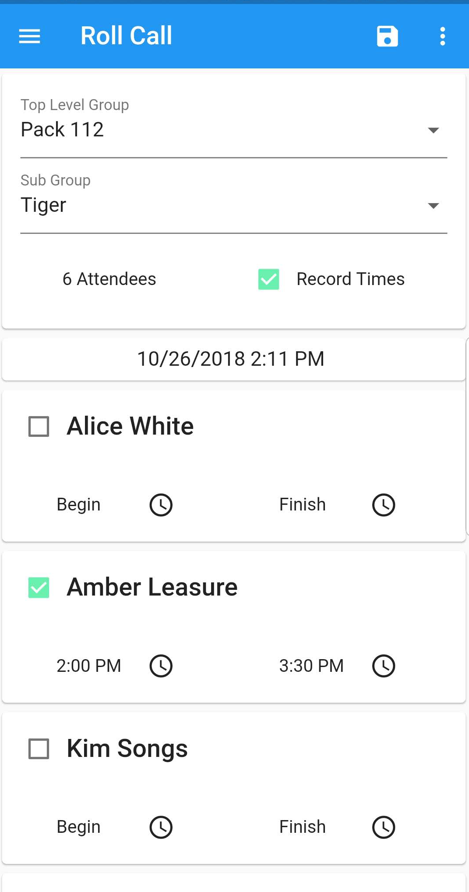

## Looking for a convenient way to track attendance?

  

  
  

  

    
  

  

    
Create top-level groups with subgroups, for example:

    
1. Algebra

      <ul>
        <li>1st Period</li>
        <li>2nd Period</li>
        <li>etc.</li>
      </ul>
    
2. Pack 112

      <ul>
        <li>Tiger</li>
        <li>Wolf</li>
        <li>etc.</li>
      </ul>
    
Create and attach attendees to subgroup

  

  

    
  

  

    
  

  

    
Track attendance as a simple yes/no checkbox, or...

  

  

    
Include start and stop times for attendees. Great for when an event rewards attendees based on time present!

  

  

    
  

  

  
  

  

    
  

## On the Web

Now you can use [Roll Call on the web](https://rollcall.netlify.com). With the ability to download attendance records!

Give it a try and let me know how it works for you. I'm always looking for feedback, to improve the app.
