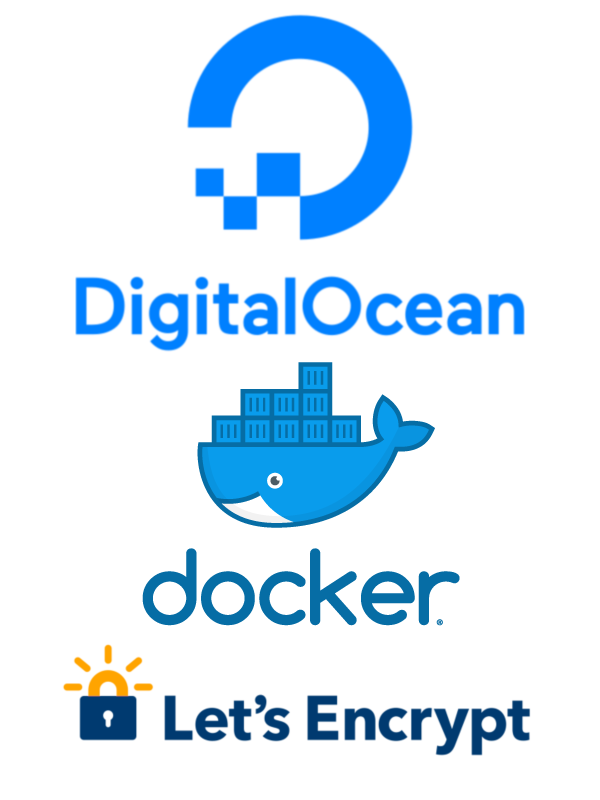
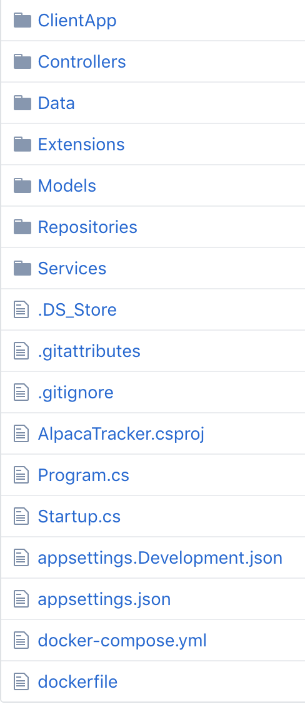
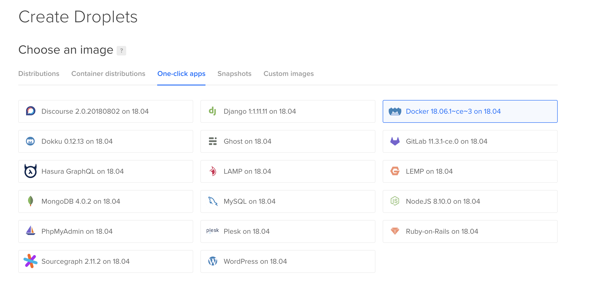

I initially deployed my .NET Core app, the [Alpaca Tracker](/alpaca/i-built-this/2018/09/02/alpaca-tracker), to Azure App Service. Overall I was pleased with the service, but not with the price! I figured I could save roughly $50 a month moving to a $10 Digital Ocean droplet. I'm writting this to share what I learned and to document the proccess for the next time I need it.

## Setting Up Docker

Before we begin, head over to the [Docker site](https://www.docker.com/get-started) and follow their directions on installing Docker on your particular platform.


Here is the folder structure for my app. Notice the dockerfile, and the docker-compose.yml.



## dockerfile

The dockerfile contains the build instructions for the dotnet app. It begins by using the sdk image for building the app and then uses a lightweight runtime image, copying the output of the previous build. Next, we expose port 5000 and specify the entry point of the application.

```javascript
// dockerfile

FROM microsoft/dotnet:2.1-sdk AS build-env
WORKDIR /app

# Copy csproj and restore
COPY *.csproj ./
RUN dotnet restore

# Copy everything else and build
COPY . ./
RUN dotnet publish -c Release -o out

# Build runtime image
FROM microsoft/dotnet:2.1-aspnetcore-runtime
WORKDIR /.
COPY --from=build-env /app/out .

ENV ASPNETCORE_URLS http://+:5000
EXPOSE 5000

# Change name of dll for your application 
ENTRYPOINT ["dotnet", "AlpacaTracker.dll"]
```


## docker-compose

Docker-Compose allows us to provide the instructions for building all of the containers needed for our deployment. It begins by defining each of our services. Here they are **app** and **https-portal**. The app service simply builds the container with dockerfile we previously created.


Next, is the [https-portal](https://github.com/SteveLTN/https-portal). What is that you ask? Well, that is the magical image that makes the whole nginx reverse-proxy and Let's Encrypt integration a beautiful experience!


From their github readme...


>HTTPS-PORTAL is a fully automated HTTPS server powered by Nginx, Let's Encrypt and Docker. By using it, you can run any existing web application over HTTPS, with only one extra line of configuration.
>
>The SSL certificates are obtained, and renewed from Let's Encrypt automatically.


The https-portal service specifies the image, ports to be exposed, links which allow the connection to the app service, and environment. The environment is where the reverse proxy is configured. The DOMAINS for this app directs it to forward everything to my domain, alpacatracker.com, on to the app service on the port that was specified in the dockerfile. Finally, the STAGE is specified so that the Let's Encrypt certificates will be downloaded and configured.

```yaml
#docker-compose.yml

version: '2'
 
services:
  app:
    build:
      context:  ./
      dockerfile: Dockerfile
  https-portal:
    image: steveltn/https-portal:1
    ports:
      - '80:80'
      - '443:443'
    links:
      - app
    restart: always
    environment:
      DOMAINS: 'alpacatracker.com -> http://app:5000'
      STAGE: 'production'
```


Before we head over to Digital Ocean, push all of these changes up to your github repo.


## Digital Ocean

Head on over to [Digital Ocean](https://www.digitalocean.com/) and signup for an account if you don't already have one. If you are signing up, you can use this [link](https://m.do.co/c/0f172e230c36) which will give you some free credits to get started, as well as to me for the referral.


## Create a new Droplet. 

Begin by selecting the one-click docker app. Next, select your size and data center region. The rest can be left as defaults, but I personally choose to add my ssh keys at this point. It just makes things easier when logging into the droplet.




## Setting up the Droplet

The first thing tht needs to be done is to log in as root, create a new user, grant them permissions, and set up the firewall. Here is a link to Digital Ocean's own guide on the matter, [Initial Server Setup with Ubuntu 18.04](https://www.digitalocean.com/community/tutorials/initial-server-setup-with-ubuntu-18-04). When you finish up there, come on back and we will continue with deploying our app.

## Domain Name

To use [let's encrypt](https://letsencrypt.org/) certificates you must first register a domain name and point it towards your server. I have been using [Google Domains](https://domains.google/) lately, but buy them from whomever your prefer and follow their directions for configuring the DNS records.


## Deploy

Now, ssh into your droplet using the user that you had created while following the server setup guide. Entering `pwd` should reveal that you are currently located at `home/USERNAME`. I chose to create a folder for my apps simply called apps, but this is entirely up to you, `mkdir apps`. If you did as I did, then `cd apps` to enter the newly created folder.

## To the Cloud 👆

Now it is time to get your code into the droplet. Inside the apps directory, simply `git clone https://github.com/NAME/REPO.git` Then cd into the newly created directory. If everything is configured correctly, you should be able to enter `docker-compose build` and see the output of the process.


When that completes, enter `docker-compose up` which will spin up the containers remaining attached to the terminal so that you view the output. If it is successful, you will see that the certificates are downloaded. Open your browser and check to see if all is well.


If it is good, hit `control-c` to shut down the containers, and now restart using `docker-compose up -d` which will run in detached mode, freeing up the terminal.


## Wrapping Up

The process is pretty straight forward, and I haven't had any problems with my site. If you encounter any problems be sure to check out the docs for [https-portal](https://github.com/SteveLTN/https-portal) as the image provides many ways to custom configure things for your individual needs.


