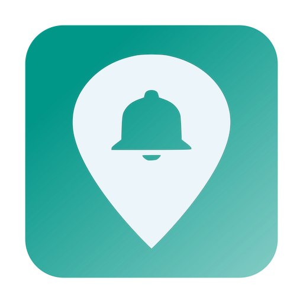
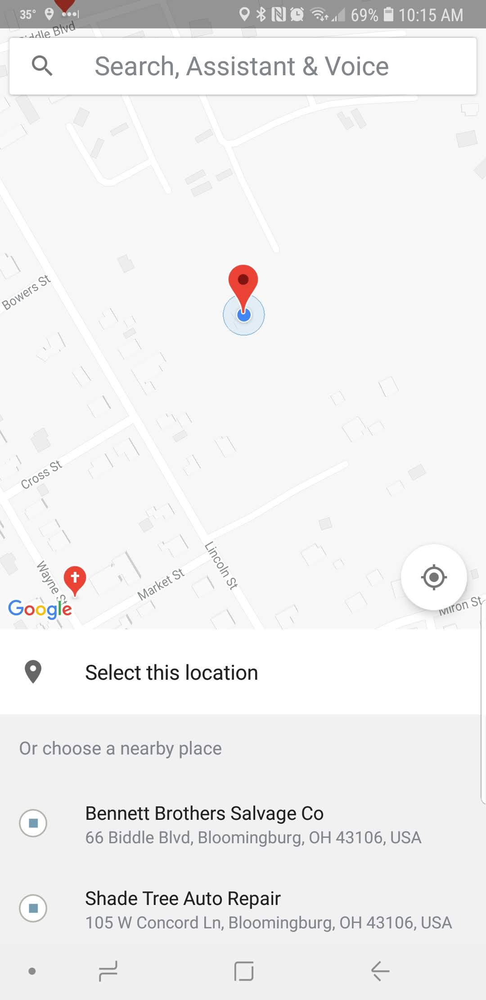
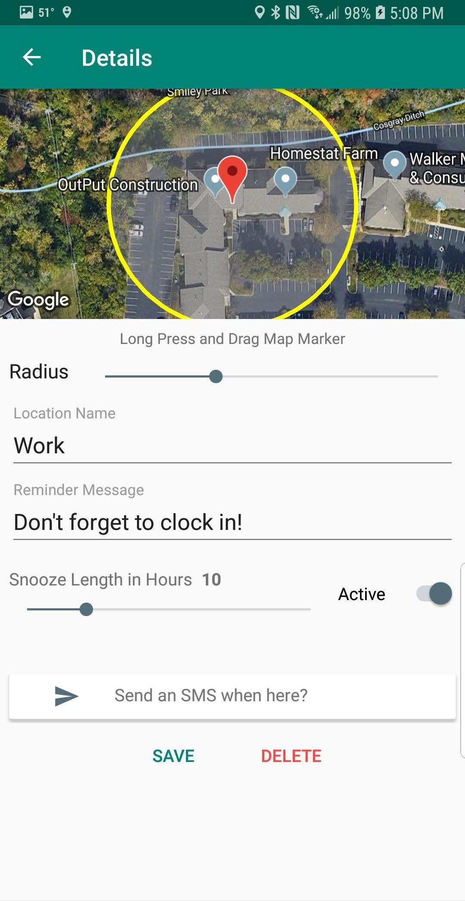
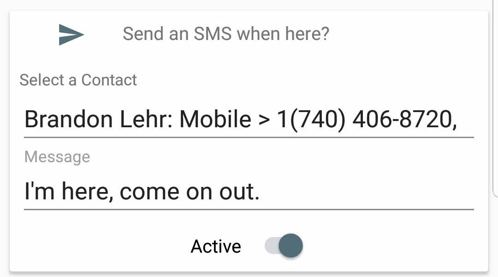
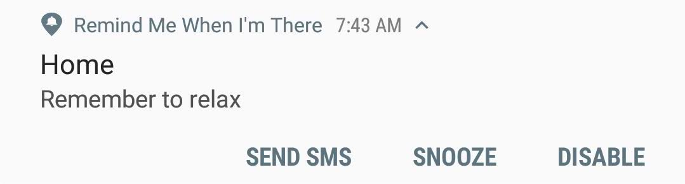
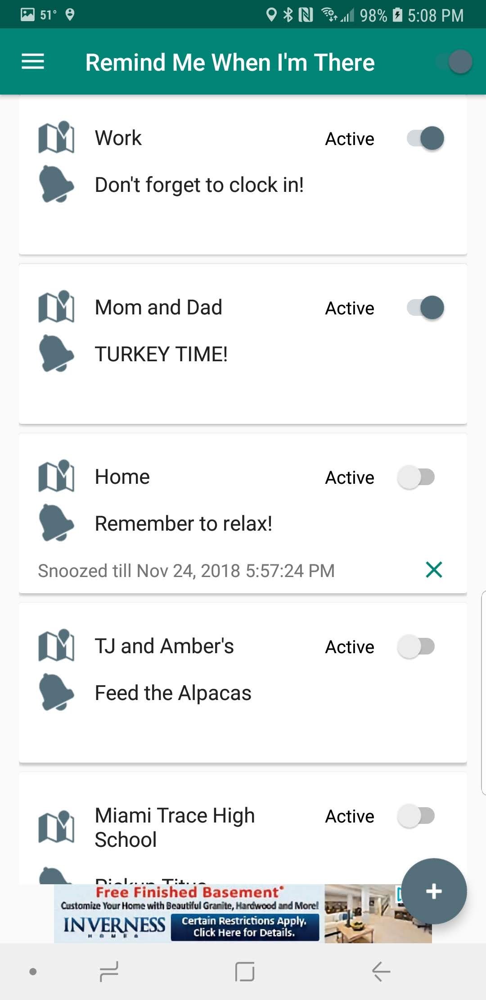
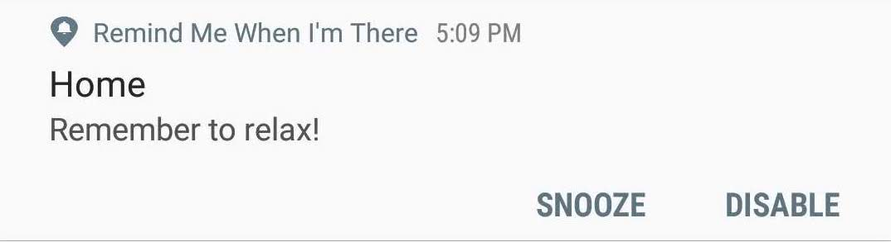
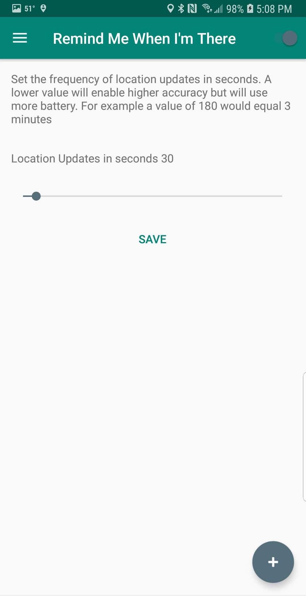

<!-- # Location Aware Reminders On Android with Remind Me When I'm There -->

## Location Aware Reminders

How many reminder apps have you tried?
How many have you actually remembered to check?

We all have that problem!

The problem is that reminders aren't needed when, they are needed **where**! With [Remind Me When I'm There](https://play.google.com/store/apps/details?id=com.brandonlehr.remindmewhenimthere) you can attach a reminder to a location that will alert you when you need it most. You even have the ability to send a text message to one or more contacts on arrival!

<i class="fas fa-map-marker-alt"></i> Work

<i class="far fa-bell" aria-hidden="true"></i> Remember to clock in

<i class="fas fa-map-marker-alt"></i> Grocery Store

<i class="far fa-bell" aria-hidden="true"></i> Remember to get Milk

## Getting Started

Clicking the floating action button on the home screen launches the Google Place Picker. From here you can pick your current location, one of the  nearby suggestions, or search for a location.

After confirming your selection, you will be navigated to the location detail page. This is where you can adjust the location by long pressing on the map marker and dragging to your desired location and adjust the notification radius using the slider below the map.

Change the location name and set a reminder. Set the snooze length. This is the length of time to ignore this reminder after snoozing it from the triggered notification. Mark the reminder active or inactive.

## Send a Text When Entering a Location

Optionally, select contacts to send a message to when the reminder is triggered. This is great for when you need to pick up one of your kids from an event or activity. Send an "I'm Here," message upon arrival!

## Update 12/20/2018 - Changes to Sending an SMS

Google recently changed access to sending direct text messages to only be allowed through default messaging apps. This feature is still available, but the process has changed. An SMS will no longer send without interaction. When a notification is received that includes the SMS option, a button in the notification will appear (Send SMS) that will initiate the process.

## See All Reminders

The main page displays all of your reminders.
From here you see the location, message, active status, and the amount of time left on a snoozed reminder. The app can be toggled on and off from the switch in the app bar.

## Control Everything From the Notification Panel

To let you know that the service is running, an on-going notification will be present when active. From here you can turn the service off without having to open the app.

When a reminder is triggered a notification will appear with the location and message present. Then you can choose between two actions. Snooze the reminder according to the length of time you have set or disable the reminder.

## Settings

The app polls the device location at an interval you specify.

## Battery Life

The app does poll the devices location, which does use some battery, but testing has shown that usage has had minimal affect on battery life.

I want this app to be as helpful as possible! Please let me know if there are any problems, or features you would like to see added!

