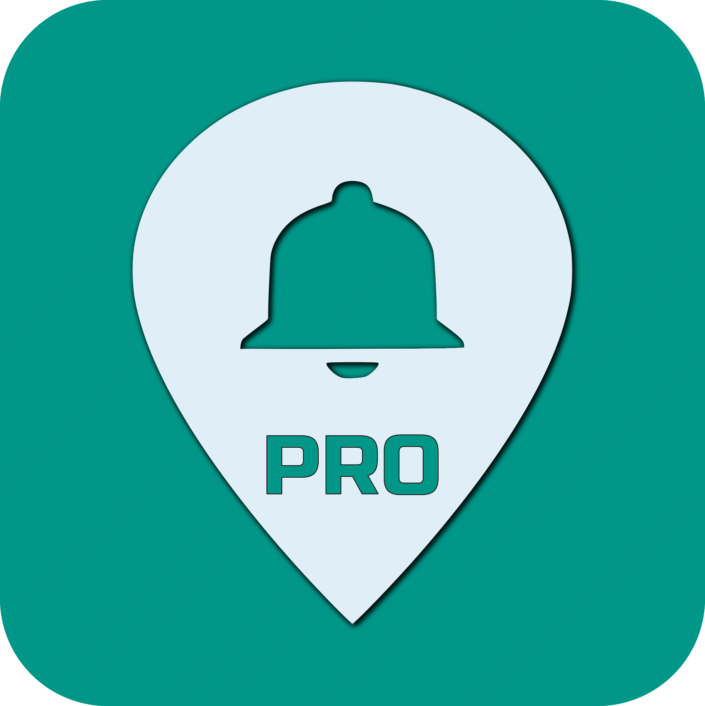

## Why Can't I Remember?

Remembering things is hard. Reminding others to remember stuff is even harder.

I know you have tried all of the reminder apps, that you never remember to check. And that you have tried scheduling reminders to notify you when you think you will need it.

### So what's the problem?

Often reminders aren't needed when <i class="fas fa-clock"></i>, they are needed where <i class="fas fa-map-marker-alt"></i>.

<i class="fas fa-map-marked-alt"></i>  When I get to the office, I have to...

<i class="fas fa-map-marked-alt"></i>  Next time I'm at the grocery store I need to get...

<i class="fas fa-map-marked-alt"></i>  Why can't my husband remember to shut the garage door when he leaves...

<i class="fas fa-map-marked-alt"></i>  When Carl gets to the client's office I need him to remember to sign in...

What do all these have in common? They need reminded at a **location**, not a time!

## Location Aware Reminders

**[Remind When I'm There](https://remindmewhenimthere.com/)** is a cross-platform suite of apps ( <i class="fab fa-android"></i> <i class="fab fa-apple"></i> <i class="fas fa-desktop"></i> ), that enable setting reminders that can be triggered anywhere you need them!

### Only Need to Remind Yourself?

Remind Me When I'm There is available for **free** on Android and iOS! Easily create reminders for any location with a custom message, and receive a notification when entering and leaving. Each notification allows you to snooze the reminder for a length of time and the option to disable the reminder until you need it again. Simple and effective, when life is full and memory is short, let Remind Me When I'm There, keep you on track!

  
  

  

    
  

 

### Need to Remind Others as Well?

Remind Me When I'm There Pro - available on Android, iOS, and the Web. Great for families and teams! Manage reminders for everyone!

Pro Features

- Choose to trigger reminders on **entering** or **leaving**
- Attach a link to an online document or website, that can be visited from the notification
- Assign reminders to individual subscribers - control who gets reminded
- View notification logs of when a reminder was triggered, who triggered it, and when
- Create and manage reminders on the web from the convenience of your laptop

  
  

  

    
  

 

Learn more about all versions, visit the [Remind When I'm There](https://remindmewhenimthere.com/) on the web.

Here is a promo video showing the Pro version on iOS

  <iframe width="560" height="315" src="https://www.youtube.com/embed/8HZQgqgNHrk" frameborder="0" allow="autoplay; encrypted-media" allowfullscreen></iframe>

