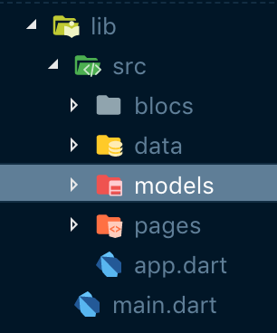
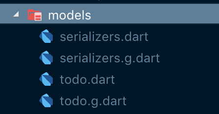

Welcome to this series on building a Flutter Tasks App utilizing the Bloc pattern, notifications, and mysql for data storage.


## Flutter Task

Flutter Task is a simple todo app inspired by Google's own Tasks app for Android. Here is an overview of what the finished app will look like.


<div class="video-container">
  <iframe width="560" height="315" src="https://www.youtube.com/embed/dblMcGSKot8" frameborder="0" allow="accelerometer; autoplay; encrypted-media; gyroscope; picture-in-picture" allowfullscreen></iframe>
</div>


### Flutter Task Series
* Part 1 - [Data Model and built\_value](/flutter/2019/05/05/flutter-task-tutorial-step-1)
* Part 2 - [Database and queries](/flutter/2019/05/06/flutter-task-tutorial-step-2)
* Part 3 - [BLoC and Inherited Widget](/flutter/2019/05/07/flutter-task-tutorial-step-3)
* Part 4 - [Add and Display Todos](/flutter/2019/05/08/flutter-task-tutorial-step-4)
* Part 5 - [Notifications](/flutter/2019/05/09/flutter-task-tutorial-step-5)

## Data Model and Serialization with Built Value

Before we get to far, let's install some dependencies for this step. We need to add built\_value to our pubspec.yaml.

```yaml
dependencies:
  flutter:
    sdk: flutter
  built_value: ^6.2.0
```

Below you will see the directory structure for this project, if you would like to create that now.

 

We will kick things off by defining our data model. Our Todo will have a todoId, title, message, due-date, and a completed status and we will use the [built_value](https://pub.dartlang.org/packages/built_value) plugin to handle generating the code for serialization. One thing worth mentioning, you can see that I created dueDate as a String, rather than a DateTime. I did this because mysql doesn't support the DateTime type, so we will convert it as needed. The completed field is an int, for the same reason as mysql doesn't support boolean values. So to get by, 0 will be false and 1 will be true. Inside of the lib folder, I created a src folder and inside of that a models folder. Here you can create todo.dart.

```dart
import 'package:built_value/built_value.dart';
import 'package:built_value/serializer.dart';

part 'todo.g.dart';

abstract class Todo implements Built<Todo, TodoBuilder> {
  static Serializer<Todo> get serializer => _$todoSerializer;
  @nullable
  int get todoId;

  @nullable
  String get title;

  @nullable
  String get message;

  @nullable
  int get completed;

  @nullable
  String get dueDate;

  Todo._();

  factory Todo([updates(TodoBuilder b)]) = _$Todo;
}

```

As you can see, we import built\_value and serializer from built\_value. Then we define an abstract class that implements Built with our model and Builder. Next is a static serializer getter that will handle serialization. The syntax basically stays the same for any class you create, just append "Builder" to the class name. The fields are all getters and I have annotated them with "@nullable" as some of them may not be present in every todo. Lastly, we a have a factory constructor. 

Now about that part keyword after the imports. Once we the run build\_runner, a new file will be created in the same directory named with the dot g, as you can see above. This statement allows the files to work together.

Lets build! In your terminal in project directory run the commands...

```bash
flutter pub run build_runner watch
```

Thankfully, if there are any problems, the terminal will output helpful messages on how to correct your issues.

Almost there! Now we need to create one more file, seralizers.dart.

```dart
import 'package:built_value/serializer.dart';
import 'package:built_value/standard_json_plugin.dart';
import 'package:flutter_task/src/models/todo.dart';

part 'serializers.g.dart';

@SerializersFor(const [Todo])
final Serializers serializers = (_$serializers.toBuilder()..addPlugin(StandardJsonPlugin())).build();
```

At the top we import serializer, standard\_json\_plugin, and our Todo model. This step simply builds the serializer for our Todo model and adds the standard json plugin for formatting the json. If you left the build runner running, you should see that a serializers.g.dart file was created. If you stopped the watcher, simply rerun it. Once this is complete you should be able to stop the runner with control-c.

Our models folder should now look like this.



Next Up - [Database and queries](/flutter/2019/05/06/flutter-task-tutorial-step-2)

[Source on Github](https://github.com/blehr/flutter_task/tree/master) 


