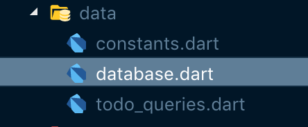

Welcome to this series on building a Flutter Tasks App utilizing the Bloc pattern, notifications, and mysql for data storage.


## Flutter Task

Flutter Task is a simple todo app inspired by Google's own Tasks app for Android. Here is an overview of what the finished app will look like.


<div class="video-container">
  <iframe width="560" height="315" src="https://www.youtube.com/embed/dblMcGSKot8" frameborder="0" allow="accelerometer; autoplay; encrypted-media; gyroscope; picture-in-picture" allowfullscreen></iframe>
</div>


### Flutter Task Series
* Part 1 - [Data Model and built\_value](/flutter/2019/05/05/flutter-task-tutorial-step-1)
* Part 2 - [Database and queries](/flutter/2019/05/06/flutter-task-tutorial-step-2)
* Part 3 - [BLoC and Inherited Widget](/flutter/2019/05/07/flutter-task-tutorial-step-3)
* Part 4 - [Add and Display Todos](/flutter/2019/05/08/flutter-task-tutorial-step-4)
* Part 5 - [Notifications](/flutter/2019/05/09/flutter-task-tutorial-step-5)

## Database and Queries

Before we get to far, let's install some dependencies for this step. We need to add sqflite and path_provider to our pubspec.yaml.

```yaml
dependencies:
  flutter:
    sdk: flutter
  built_value: ^6.2.0
  sqflite: any
  path_provider: ^0.4.1
```

Today we will be working in our data folder if you are using the same project structure as I do.

 

Let's start by defining all of our Constants for the Table and Column names - constants.dart.

```dart
class Constants {
  static final Constants _instance = Constants._internal();

  factory Constants() {
    return _instance;
  }

  Constants._internal();

  static final String todoTable = 'TodoTable';
  static final String id = 'todoId';
  static final String title = 'title';
  static final String message = 'message';
  static final String completed = 'completed';
  static final String dueDate = 'dueDate';

}

```

We write a Constants class, converting it to singleton with static fields defining our data.

### Now, on to the database - database.dart

```dart
import 'package:sqflite/sqflite.dart';
import 'dart:async';
import 'package:path/path.dart';
import 'package:flutter_task/src/data/constants.dart';

class DatabaseHelper {
  static final DatabaseHelper _instance = new DatabaseHelper._internal();

  factory DatabaseHelper() => _instance;

  static Database _db;

  Future<Database> get() async {
    Sqflite.devSetDebugModeOn(true);
    if (_db != null) {
      return _db;
    }
    _db = await initDb();

    return _db;
  }

  DatabaseHelper._internal();

  initDb() async {
    String databasesPath = await getDatabasesPath();
    String path = join(databasesPath, 'main.db');

    var db = await openDatabase(path, version: 1, onCreate: _onCreate);
    return db;
  }

  void _onCreate(Database db, int newVersion) async {
    await db.execute("CREATE TABLE ${Constants.todoTable}(${Constants.id} INTEGER PRIMARY KEY AUTOINCREMENT, ${Constants.title} TEXT, ${Constants.message} TEXT, ${Constants.completed} INTEGER, ${Constants.dueDate} TEXT)");

    print("Database Created");
  }

}
```

At the top we import [sqflite](https://pub.dartlang.org/packages/sqflite) our database plugin, as well as async, path, and our constants file. Basically, we are creating a DatabaseHelper class that initializes and returns a database. It is a singleton just as our constants are.

There is a getter for the database that checks to see if it has already been created and opened. If so, then that instance is returned and if not, one is opened or created.

If it needs to opened, initDb is called, finding the path and applying the database name, and then the database is either opened or created if need be. In the openDatabase call, the path is specified as well as the version number and a function to be called if the database hasn't been created as of yet.

In this database creation method, _onCreate, all of the tables can be created. This is where you can see the usefulness of the constants file that we created earlier.

### The Queries - todo_queries.dart

```dart
import 'package:flutter_task/src/data/constants.dart';
import 'package:flutter_task/src/data/database.dart';
import 'package:flutter_task/src/models/serializers.dart';
import 'package:flutter_task/src/models/todo.dart';
import 'package:sqflite/sqflite.dart';

class TodoQueries {
  static final TodoQueries _instance = TodoQueries._internal();

  factory TodoQueries() {
    return _instance;
  }

  TodoQueries._internal();

  Future<Database> db = DatabaseHelper().get();

  Future<int> addTodo(Todo todo) async {
    var dbClient = await db;
    var mapTodo = serializers.serializeWith(Todo.serializer, todo);
    print(mapTodo);
    int res = await dbClient.insert(Constants.todoTable, mapTodo);
    return res;
  }

  Future<List<Todo>> getIncompleteTodos() async {
    var dbClient = await db;
    List<Map<String, dynamic>> rawTodos =  await dbClient.rawQuery('SELECT * FROM ${Constants.todoTable} WHERE ${Constants.completed} = 0 ORDER BY ${Constants.dueDate} ASC');
    return rawTodos.map((b) => serializers.deserializeWith(Todo.serializer, b)).toList();
  }

  Future<List<Todo>> getCompletedTodos() async {
    var dbClient = await db;
    List<Map<String, dynamic>> rawTodos =  await dbClient.rawQuery('SELECT * FROM ${Constants.todoTable} WHERE ${Constants.completed} = 1 ORDER BY ${Constants.dueDate} DESC');
    return rawTodos.map((b) => serializers.deserializeWith(Todo.serializer, b)).toList();
  }

  Future<int> updateTodo(Todo todo) async {
    var dbClient = await db;
    int res = await dbClient.update(Constants.todoTable, serializers.serializeWith(Todo.serializer, todo), where: "${Constants.id} = ?", whereArgs: [todo.todoId]);
    return res;
  }

  Future<int> deleteTodo(Todo todo) async {
    var dbClient = await db;
    int res = await dbClient.rawDelete("DELETE FROM ${Constants.todoTable} WHERE ${Constants.id} = ${todo.todoId}");
    return res;
  }

  Future closeDb() async {
    var dbClient = await db;
    dbClient.close();
  }

}
```
We create the TodoQueries class as a singleton as well, importing our constants, database, serializers, model, and sqflite.

Because of the getter we created in the DatabaseHelper class we can retrieve the database with `Future<Database> db = DatabaseHelper().get();`

Let's take a closer look at the addTodo method.

```dart
 Future<int> addTodo(Todo todo) async {
    var dbClient = await db;
    var mapTodo = serializers.serializeWith(Todo.serializer, todo);
    print(mapTodo);
    int res = await dbClient.insert(Constants.todoTable, mapTodo);
    return res;
  }
```

We specify a return value of a future int and a parameter of Todo. The next line awaits the db which is assigned to dbClient. Next we have to convert our Todo into a Map, so that it can be inserted into the database. This is done using our serialzers that we created during the built\_value step.

Now we can insert by calling dbClient.insert specifying the Table name and the formatted todo.

Then the result is then returned.

Now that we can add data, lets get some back. Here is the get completed todos method.

```dart
Future<List<Todo>> getCompletedTodos() async {
    var dbClient = await db;
    List<Map<String, dynamic>> rawTodos =  await dbClient.rawQuery('SELECT * FROM ${Constants.todoTable} WHERE ${Constants.completed} = 1 ORDER BY ${Constants.dueDate} DESC');
    return rawTodos.map((b) => serializers.deserializeWith(Todo.serializer, b)).toList();
  }
```

I created separate methods for getting completed and in-completed todos. This is because these will later be displayed on different screens.

The data can be retrieved with a rawQuery.

```sql
'SELECT * FROM ${Constants.todoTable} WHERE ${Constants.completed} = 1 ORDER BY ${Constants.dueDate} DESC'
```

Here I am selecting everything in the TodoTable where the completed status is 1, (true), and ordered by due date descending.

The returned data from the database will be in the format of a List of Map<String, dynamic>. This List can then be mapped over calling serializers.deserializeWith to convert to a Todo Model and then the whole thing can be cast back to a list.

## Hang in There


I know, I know, when are we going to build some ui? It's coming soon! We just have to get through setting up our BLoC to bridge between the data and the ui.

Next Up - [BLoC and Inherited Widget](/flutter/2019/05/07/flutter-task-tutorial-step-3)

[Source on Github](https://github.com/blehr/flutter_task/tree/master) 


