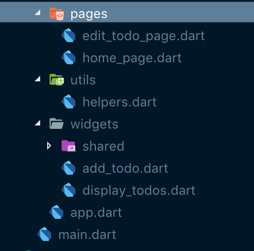

Welcome to this series on building a Flutter Tasks App utilizing the Bloc pattern, notifications, and mysql for data storage.


## Flutter Task

Flutter Task is a simple todo app inspired by Google's own Tasks app for Android. Here is an overview of what the finished app will look like.


<div class="video-container">
  <iframe width="560" height="315" src="https://www.youtube.com/embed/dblMcGSKot8" frameborder="0" allow="accelerometer; autoplay; encrypted-media; gyroscope; picture-in-picture" allowfullscreen></iframe>
</div>


### Flutter Task Series
* Part 1 - [Data Model and built\_value](/flutter/2019/05/05/flutter-task-tutorial-step-1)
* Part 2 - [Database and queries](/flutter/2019/05/06/flutter-task-tutorial-step-2)
* Part 3 - [BLoC and Inherited Widget](/flutter/2019/05/07/flutter-task-tutorial-step-3)
* Part 4 - [Add and Display Todos](/flutter/2019/05/08/flutter-task-tutorial-step-4)
* Part 5 - [Notifications](/flutter/2019/05/09/flutter-task-tutorial-step-5)

## Add and Display Todos

Let's add a dependency of intl to handle DateTimes in the pubspec.yaml

```yaml
dependencies:
  flutter:
    sdk: flutter
  rxdart: ^0.20.0
  built_value: ^6.2.0
  sqflite: any
  path_provider: ^0.4.1
  intl: ^0.15.7
```

Here is where we are working today.

 

Here is how the main.dart look.

```dart
import 'package:flutter/material.dart';
import 'src/app.dart';

void main() => runApp(App());
```

And now for the app.dart.

```dart
import 'package:flutter/material.dart';
import 'package:flutter_task/src/pages/edit_todo_page.dart';
import 'blocs/app_state_provider.dart';
import 'pages/home_page.dart';

class App extends StatelessWidget {
  @override
  Widget build(BuildContext context) {
    return AppStateProvider(
      child: MaterialApp(
        initialRoute: '/',
        routes: {
          '/': (context) => MyHomePage(),
          // '/edit': (context) => EditTodoPage(),
        },
        title: 'Flutter Demo',
        theme: ThemeData(
          primarySwatch: Colors.blue,
        ),
      ),
    );
  }
}
```

The AppStateProvider wraps the entire Material app so that it can be accessed anywhere below in the tree. There is one route that we will be concerned with for now and that is to the home page.

### Home Page - home_page.dart

```dart
import 'package:flutter/material.dart';
import 'package:flutter_task/src/blocs/app_state_provider.dart';
import 'package:flutter_task/src/widgets/add_todo.dart';
import 'package:flutter_task/src/widgets/display_todos.dart';

class MyHomePage extends StatelessWidget {
  void _showModalSheet(context) {
    showModalBottomSheet(
        context: context,
        builder: (builder) {
          return AddTodo();
        });
  }

  @override
  Widget build(BuildContext context) {
    final todoBloc = AppStateProvider.of(context);
    todoBloc.getIncompleteTodos();
    return Scaffold(
      appBar: AppBar(
        title: Text("Flutter Task"),
      ),
      body: Column(
        crossAxisAlignment: CrossAxisAlignment.center,
        children: <Widget>[
          DisplayTodos(),
        ],
      ),
      bottomNavigationBar: BottomAppBar(
        shape: CircularNotchedRectangle(),
        child: Row(
          mainAxisAlignment: MainAxisAlignment.spaceBetween,
          children: <Widget>[
            IconButton(
              icon: Icon(Icons.archive),
              onPressed: () {
                Navigator.pushNamed(context, '/archive');
              },
            )
          ],
        ),
      ),
      floatingActionButton: FloatingActionButton(
        onPressed: () => _showModalSheet(context),
        child: Icon(Icons.add),
      ),
      floatingActionButtonLocation: FloatingActionButtonLocation.centerDocked,
    );
  }
}

```

The Home page is a stateless widget with a Bottom Navigation Bar and a Floating Action Button. The FAB will show a Modal Bottom Sheet, the function for that is the first method, which will display the AddTodo widget that we will build in a minute. The Bottom Bar has an icon that will navigate to the archive page, that hasn't been written yet. The body is a Column containing the DisplayTodos widget.

### DisplayTodos - display_todos.dart

```dart
import 'package:flutter/material.dart';
import 'package:flutter_task/src/blocs/app_state_provider.dart';
import 'package:flutter_task/src/models/todo.dart';
import 'package:flutter_task/src/utils/helpers.dart';

class DisplayTodos extends StatelessWidget {
  @override
  Widget build(BuildContext context) {
    final todoBloc = AppStateProvider.of(context);
    return Flexible(
      child: StreamBuilder(
        stream: todoBloc.todoStream,
        builder: (BuildContext context, AsyncSnapshot<List<Todo>> snapshot) {
          if (snapshot.hasData && snapshot.data.length > 0) {
            return ListView.builder(
              itemBuilder: (context, index) =>
                  TodoCard(todo: snapshot.data[index]),
              itemCount: snapshot.data.length,
            );
          } else {
            return Container();
          }
        },
      ),
    );
  }
}

class TodoCard extends StatelessWidget {
  final Todo todo;

  TodoCard({
    Key key,
    @required this.todo,
  })  : assert(todo != null),
        super(key: key);

  Color computeDateColor(dateString) {
    if (dateString == null || dateString == '') {
      return Colors.transparent;
    }
    
    DateTime now = DateTime.now();
    DateTime todoDate = DateTime.parse(dateString);

    int dayDiff = todoDate.difference(DateTime(now.year, now.month, now.day)).inDays;

    if (dayDiff < 0) {
      return Colors.red;
    }

    if (dayDiff == 0) {
      return Colors.blue;
    }

    return Colors.black54;
  }

  Widget build(BuildContext context) {
    final todoBloc = AppStateProvider.of(context);
    return Dismissible(
      key: Key(todo.todoId.toString()),
      direction: DismissDirection.horizontal,
      onDismissed: (direction) {
        todoBloc.changeCompletion(todo);
      },
      background: Container(
        color: Colors.greenAccent,
        child: Padding(
          padding: EdgeInsets.only(left: 8.0),
          child: Align(
            alignment: Alignment.centerLeft,
            child: Icon(
              Icons.archive,
              color: Colors.white,
            ),
          ),
        ),
      ),
      child: Container(
        decoration: BoxDecoration(
          border: Border(
            bottom: BorderSide(color: Theme.of(context).dividerColor),
          ),
        ),
        padding: EdgeInsets.symmetric(vertical: 8.0),
        child: InkWell(
          borderRadius: BorderRadius.circular(8.0),
          highlightColor: Theme.of(context).accentColor,
          splashColor: Theme.of(context).primaryColor,
          onTap: () {
            todoBloc.addSingleTodo(todo);
            Navigator.pushNamed(context, '/edit');
          },
          child: Container(
            padding: EdgeInsets.fromLTRB(16.0, 8.0, 16.0, 8.0),
            width: MediaQuery.of(context).size.width,
            child: Column(
              crossAxisAlignment: CrossAxisAlignment.start,
              mainAxisAlignment: MainAxisAlignment.start,
              children: <Widget>[
                todo.dueDate != null && todo.dueDate != ''
                    ? Wrap(
                        crossAxisAlignment: WrapCrossAlignment.center,
                        children: <Widget>[
                          Icon(Icons.calendar_today,
                              color: computeDateColor(todo.dueDate)),
                          Padding(
                            padding: EdgeInsets.only(left: 8.0),
                            child: Text(
                              Helpers.displayDateFormat(
                                  dateString: todo.dueDate),
                              style: TextStyle(fontWeight: FontWeight.normal),
                            ),
                          )
                        ],
                      )
                    : Container(),
                Hero(
                  tag: todo.todoId,
                  child: Text(
                    todo.title ?? '',
                    style: Theme.of(context).textTheme.title,
                    softWrap: true,
                  ),
                ),
              ],
            ),
          ),
        ),
      ),
    );
  }
}

```

Above is all of the code in DisplayTodos.

### AddTodo - add_todo.dart

```dart
import 'dart:async';
import 'dart:math';

import 'package:flutter/material.dart';
import 'package:flutter_task/src/blocs/app_state_provider.dart';
import 'package:flutter_task/src/utils/helpers.dart';
import 'package:flutter_task/src/widgets/shared/controlled_text_field.dart';

class AddTodo extends StatefulWidget {
  AddTodo({Key key}) : super(key: key);

  @override
  AddTodoState createState() => AddTodoState();
}

class AddTodoState extends State<AddTodo> with TickerProviderStateMixin {
  bool showMessage = false;
  bool showOptions = false;

  FocusNode titleFocusNode;
  FocusNode messageFocusNode;

  AnimationController _rotationController;
  AnimationController _animationOptionsController;
  Animation<Offset> _offset;
  Animation<double> _turns;

  @override
  void initState() {
    super.initState();
    _animationOptionsController = AnimationController(
        vsync: this, duration: const Duration(milliseconds: 400));
    _offset = Tween<Offset>(begin: Offset(-1.5, 0.0), end: Offset.zero)
        .animate(_animationOptionsController);

    _rotationController = AnimationController(
        duration: const Duration(milliseconds: 200),
        vsync: this,
        upperBound: pi / 4);
    _turns = Tween(begin: 0.0, end: pi / 4).animate(_rotationController);

    titleFocusNode = FocusNode();
    messageFocusNode = FocusNode();
  }

  @override
  void dispose() {
    _animationOptionsController.dispose();
    _rotationController.dispose();
    titleFocusNode.dispose();
    messageFocusNode.dispose();
    super.dispose();
  }

  void toggleOptions() {
    setState(() {
      showOptions = !showOptions;
    });

    switch (_animationOptionsController.status) {
      case AnimationStatus.completed:
        _animationOptionsController.reverse();
        _rotationController.reverse();
        break;
      case AnimationStatus.dismissed:
        _animationOptionsController.forward();
        _rotationController.forward();
        break;
      default:
    }
  }

  void toggleShowMessage() {
    setState(() {
      showMessage = !showMessage;
    });
  }

  Future<String> _selectDate(BuildContext context) async {
    final DateTime picked = await showDatePicker(
        context: context,
        initialDate: DateTime.now(),
        firstDate: DateTime(2015, 8),
        lastDate: DateTime(2101));
    if (picked != null) {
      return picked.toIso8601String();
    }
    return null;
  }

  @override
  Widget build(BuildContext context) {
    final todoBloc = AppStateProvider.of(context);
    return Padding(
      padding: EdgeInsets.all(16.0),
      child: Column(
        crossAxisAlignment: CrossAxisAlignment.start,
        children: <Widget>[
          ControlledTextField(
            readValues: todoBloc.title,
            addValues: todoBloc.changeTitle,
            name: 'Task',
            shouldFocus: true,
            focusNode: titleFocusNode,
          ),
          AnimatedSize(
            curve: Curves.fastOutSlowIn,
            child: new Container(
              height: showMessage ? null : 0.0,
              child: showMessage
                  ? ControlledTextField(
                      readValues: todoBloc.message,
                      addValues: todoBloc.changeMessage,
                      name: 'Details',
                      focusNode: messageFocusNode,
                    )
                  : Container(),
            ),
            vsync: this,
            duration: new Duration(milliseconds: 800),
          ),
          AnimatedSize(
            curve: Curves.fastOutSlowIn,
            child: StreamBuilder(
              stream: todoBloc.dueDate,
              builder: (context, snapshot) {
                if (snapshot.hasData) {
                  return Container(
                    child: Chip(
                      onDeleted: () => todoBloc.changeDueDate(null),
                      label: Text(
                        'Due: ' +
                            Helpers.displayDateFormat(
                                dateString: snapshot.data),
                        textAlign: TextAlign.left,
                      ),
                    ),
                  );
                } else {
                  return Container(
                    height: 0.0,
                  );
                }
              },
            ),
            vsync: this,
            duration: new Duration(milliseconds: 800),
          ),
          ButtonTheme.bar(
            child: ButtonBar(
              alignment: MainAxisAlignment.spaceBetween,
              children: <Widget>[
                Row(
                  children: <Widget>[
                    RotationTransition(
                      turns: _turns,
                      child: IconButton(
                        icon: Icon(Icons.add_circle_outline),
                        color: showOptions
                            ? Theme.of(context).disabledColor
                            : Theme.of(context).primaryColor,
                        onPressed: toggleOptions,
                      ),
                    ),
                    SlideTransition(
                      position: _offset,
                      child: Align(
                        alignment: Alignment.centerRight,
                        child: Row(
                          children: <Widget>[
                            AnimatedOpacity(
                              opacity: showOptions ? 1 : 0,
                              duration: showOptions
                                  ? Duration(milliseconds: 1500)
                                  : Duration(milliseconds: 150),
                              child: IconButton(
                                  icon: Icon(Icons.short_text),
                                  color: Theme.of(context).primaryColor,
                                  onPressed: () {
                                    toggleShowMessage();
                                    Timer(Duration(milliseconds: 800), () {
                                      showMessage
                                          ? FocusScope.of(context)
                                              .requestFocus(messageFocusNode)
                                          : FocusScope.of(context)
                                              .requestFocus(titleFocusNode);
                                    });
                                  }),
                            ),
                            AnimatedOpacity(
                              opacity: showOptions ? 1 : 0,
                              duration: showOptions
                                  ? Duration(milliseconds: 1200)
                                  : Duration(milliseconds: 150),
                              child: IconButton(
                                  icon: Icon(Icons.calendar_today),
                                  color: Theme.of(context).primaryColor,
                                  onPressed: () async {
                                    var date = await _selectDate(context);
                                    if (date != null) {
                                      todoBloc.changeDueDate(date);
                                    }
                                  }),
                            ),
                          ],
                        ),
                      ),
                    ),
                  ],
                ),
                Row(
                  children: <Widget>[
                    FlatButton(
                      child: Text('Save'),
                      onPressed: () async {
                        var res = await todoBloc.submitTodo();
                        if (res != null) {
                          Navigator.of(context).pop();
                        }
                      },
                    ),
                    FlatButton(
                      onPressed: () => todoBloc.clearAddTodo(),
                      child: Text("Clear"),
                    )
                  ],
                )
              ],
            ),
          )
        ],
      ),
    );
  }
}

```

The first thing to point out, is that instead of using the flutter TextField widget for text inputs, I'm using a custom widget I call a ControlledTextField. I created this to make incorporating with streams and the bloc pattern easier. 

### ControlledTextField - controlled\_text\_field.dart

```dart
import 'dart:async';

import 'package:flutter/material.dart';

class ControlledTextField extends StatefulWidget {
  ControlledTextField(
      {Key key,
      this.readValues,
      this.addValues,
      this.name,
      this.initialValue,
      this.shouldFocus,
      this.focusNode,
      this.textStyle})
      : super(key: key);

  final Stream<String> readValues;

  final Function(String) addValues;

  final String name;

  final String initialValue;

  final TextStyle textStyle;

  final bool shouldFocus;

  final FocusNode focusNode;

  @override
  _ControlledTextFieldState createState() => _ControlledTextFieldState();
}

class _ControlledTextFieldState extends State<ControlledTextField> {
  TextEditingController textController = TextEditingController();

  StreamSubscription listener;

  @override
  void initState() {
    super.initState();
    listener = widget.readValues.listen((text) async {
      if (text == null) {
        textController.clear();
      }
    });

    if (widget.initialValue != null) {
      textController.text = widget.initialValue;
      widget.addValues(widget.initialValue);
    }
  }

  void dispose() {
    super.dispose();
    listener.cancel();
    widget.addValues(null);
    textController.dispose();
  }

  @override
  Widget build(BuildContext context) {
    return StreamBuilder(
      stream: widget.readValues,
      builder: (context, snapshot) {
        return TextField(
          onChanged: widget.addValues,
          textCapitalization: TextCapitalization.sentences,
          keyboardType: TextInputType.multiline,
          controller: textController,
          autofocus: widget.shouldFocus != null ? true : false,
          autocorrect: true,
          maxLines: null,
          textInputAction: TextInputAction.newline,
          style: widget.textStyle != null ? widget.textStyle : null,
          focusNode: widget.focusNode != null ? widget.focusNode : null,
          decoration: InputDecoration(
            hintText: widget.name,
            border: InputBorder.none,
            errorText: snapshot.error,
            isDense: true,
          ),
        );
      },
    );
  }
}


```


Next Up - [Notifications](/flutter/2019/05/09/flutter-task-tutorial-step-5)

[Source on Github](https://github.com/blehr/flutter_task/tree/master) 


