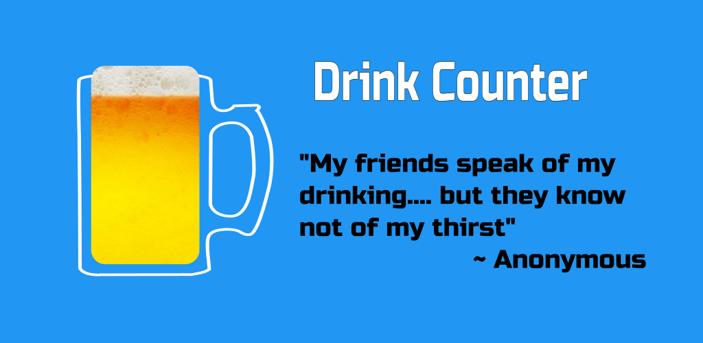
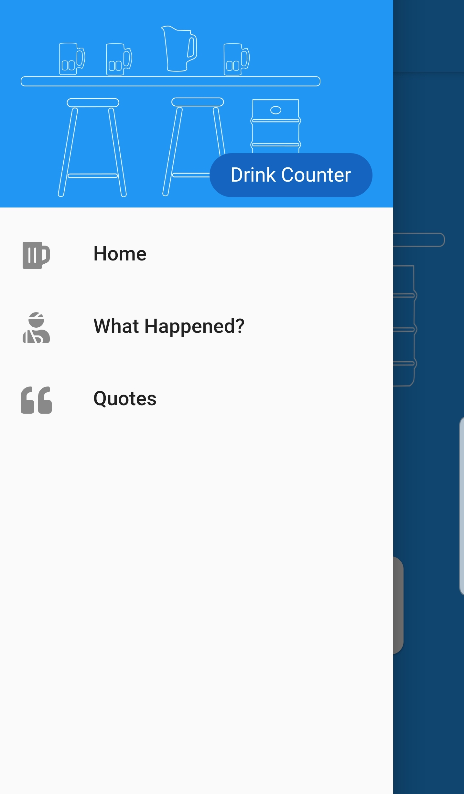
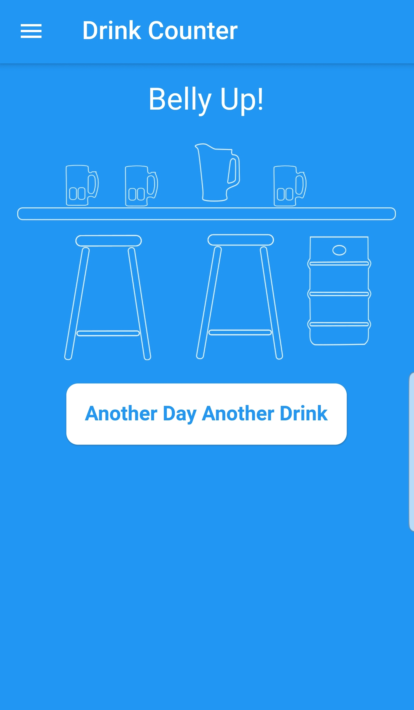
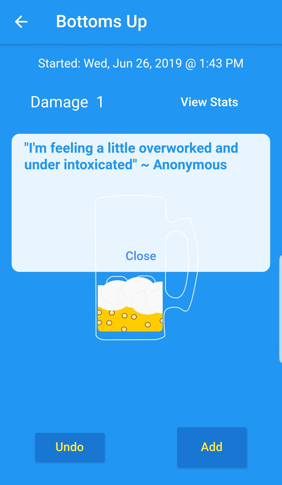
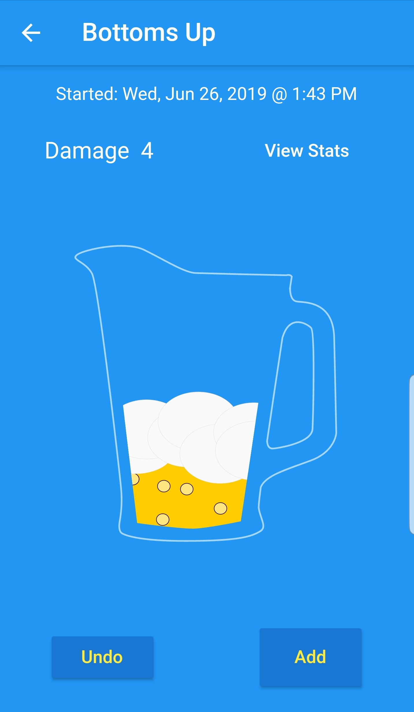
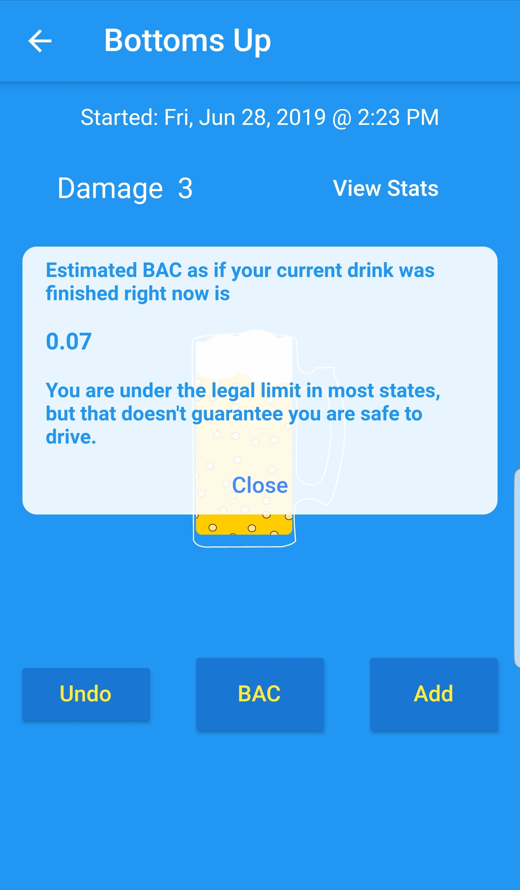
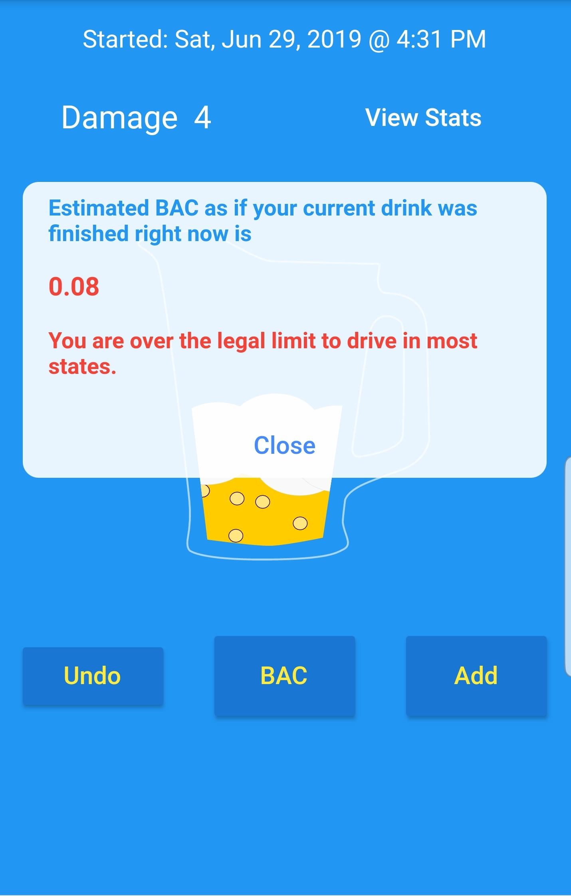
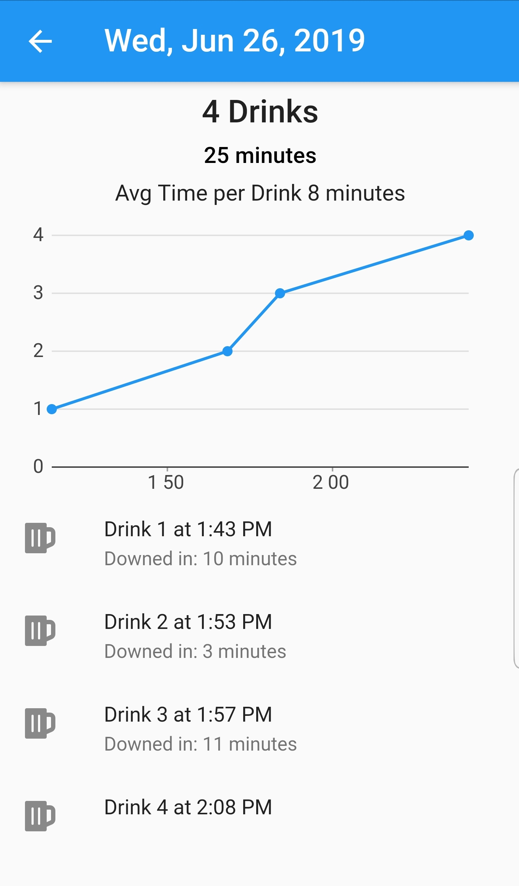
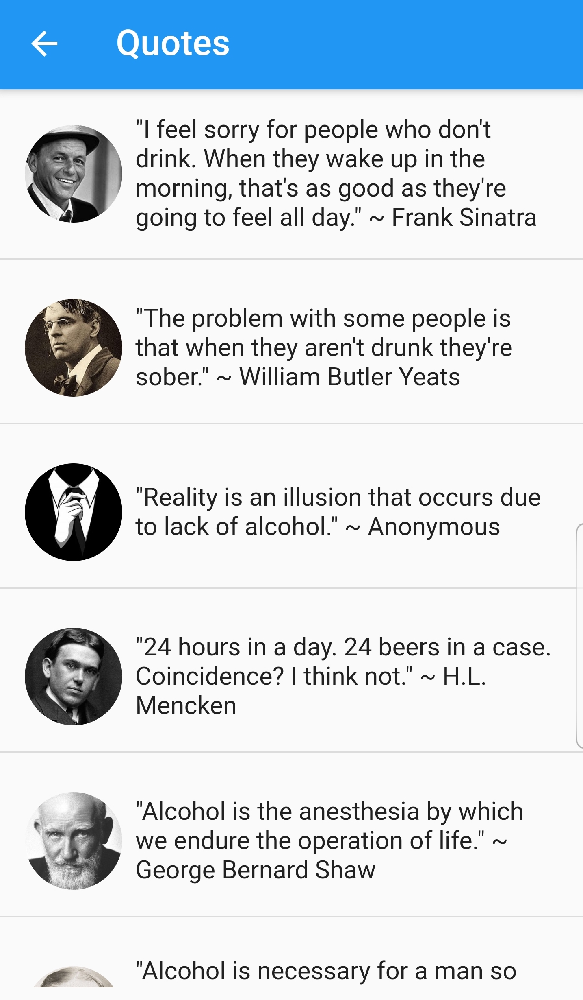

  

  
  

  

    
  

My latest app is, Drink Counter! A delightful app for tracking the number and timing of your drinks.

  

    
    

  

    
  

Grab a drink and add it to the count. Watch as the containers fill and get larger. Enjoy a nice quote, or if they're going down smooth, maybe see a warning on how fast you're drinking.

  

    
    

  

    
  

After setting up your details in settings, estimating your BAC is just a click away.

  

    
    

  

    
  

Check your stats! This could be handy when trying to figure out why you feel so badly in the morning!

Browse a great selection of quotes, for drinking inspiration!

  

    
    

  

    
  

Available for Android and iOS.

  

  
  

  

    
  

Let me know what you think, or if you have any suggestions or quotes that should be added.
